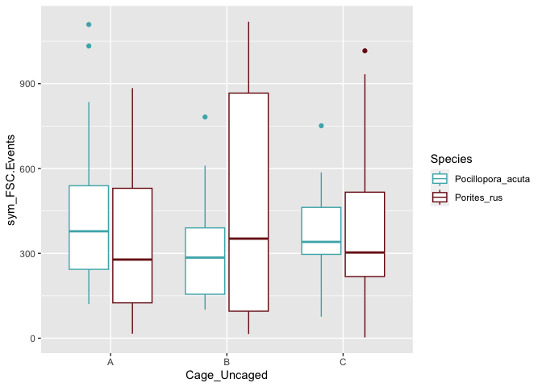
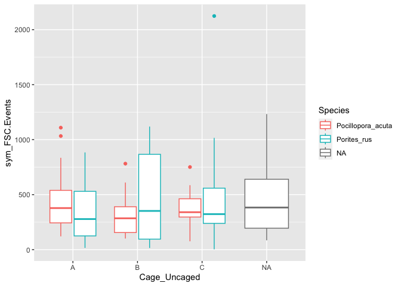

Coral
================
Callie Stephenson
2023-08-29

## Introduction

This is a R Markdown file in which I hope to write out my analyses. I
will use this document to process all the R scripts found in the R
folder and complete my project.

#### Loading the data

## Buoyant Weight

### Data Exploration:

Data exploration focuses on the following points: 1. Outliers 2.
Collinearity 3. Independence (Relationships between response and
explanatory variables)

#### Look for Outliers:

It looks like that 13 A is really off. We know it broke, so I am
removing it and replotted next to it:

<!-- -->

## TLE

### Data Exploration:

Data exploration focuses on the following points: 1. Outliers 2.
Collinearity 3. Independence (Relationships between response and
explanatory variables)

<!-- --> \## Symbionts

### Data Exploration:

Data exploration focuses on the following points: 1. Outliers 2.
Collinearity 3. Independence (Relationships between response and
explanatory variables)

FCM Data Analysis:
<!-- --><!-- -->

``` r
FCM$CowTagID <- paste0("V",FCM$Pin_Number) #make a joining variable
all_data <- left_join(FCM, nut, by="CowTagID")  #join them
all_data <- drop_na(all_data)

m1 <- lm(sym_FSC.Events ~ log(Maximum), data= all_data %>%
           filter(Parameters=="Silicate_umolL"))
anova(m1)
```

    ## Analysis of Variance Table
    ## 
    ## Response: sym_FSC.Events
    ##               Df   Sum Sq Mean Sq F value Pr(>F)
    ## log(Maximum)   1    11277   11277   0.108  0.743
    ## Residuals    117 12219556  104441

``` r
summary(m1)
```

    ## 
    ## Call:
    ## lm(formula = sym_FSC.Events ~ log(Maximum), data = all_data %>% 
    ##     filter(Parameters == "Silicate_umolL"))
    ## 
    ## Residuals:
    ##     Min      1Q  Median      3Q     Max 
    ## -406.19 -226.12  -75.15  117.91 1718.76 
    ## 
    ## Coefficients:
    ##              Estimate Std. Error t value Pr(>|t|)    
    ## (Intercept)    388.77      54.79   7.096 1.06e-10 ***
    ## log(Maximum)    16.43      49.99   0.329    0.743    
    ## ---
    ## Signif. codes:  0 '***' 0.001 '**' 0.01 '*' 0.05 '.' 0.1 ' ' 1
    ## 
    ## Residual standard error: 323.2 on 117 degrees of freedom
    ## Multiple R-squared:  0.000922,   Adjusted R-squared:  -0.007617 
    ## F-statistic: 0.108 on 1 and 117 DF,  p-value: 0.743

``` r
max <- all_data %>% 
       filter(Parameters=="Silicate_umolL")

hist(max$Maximum)
```

<!-- -->
