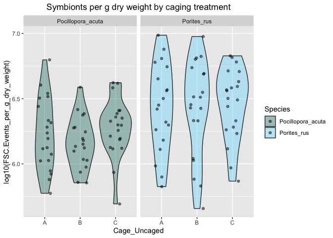

Coral
================
Callie Stephenson
2023-08-29

## Introduction

This is a R Markdown file in which I hope to write out my analyses. I
will use this document to process all the R scripts found in the R
folder and complete my project.

#### Loading the data

### Data Exploration:

Data exploration focuses on the following points: 1. Outliers 2.
Collinearity 3. Independence (Relationships between response and
explanatory variables)

#### Look for Outliers:

Buoyant Weight It looks like that 13 A is really off. We know it broke,
so I am removing it and replotted next to it:

<!-- --> I
removed PRU V13 A placement because this was broken in the field,
creating a large negative change in buoyant weight.

TLE <!-- -->

### Symbionts

<!-- --> Jess will rerun
PRU 49 (PRU V17 C) with her samples - I likely added twice as much as
needed to the sample, but for now I will omit in my analyses (using
dataframe FCM_no for “no outliers”)

Now I’m going to make the symbiont data for the full sample

``` r
#upscale it to the full sample
#sample ran was 280 µL, full sample was 50mL
FCM_no$sym_FSC.Events.μL.V._full <- FCM_no$sym_FSC.Events.μL.V. * (50 / 0.28)
FCM_no <- merge(FCM_no, sa[, c('Placement_Code', 'Surface_Area')], by = 'Placement_Code') #make a joining variable
FCM_no$sym_FSC.Events.μL.V._normalized <- FCM_no$sym_FSC.Events.μL.V._full / FCM_no$Surface_Area #divide by the surface area for symbionts per cm

dotchart(FCM_no$sym_FSC.Events.μL.V._normalized, main = "Normalized Symbionts", groups = FCM_no$Cage_Uncaged)
```

<!-- -->

``` r
boxplot(FCM_no$sym_FSC.Events.μL.V._normalized ~ FCM_no$Cage_Uncaged)
```

<!-- -->

FCM Data Analysis: <!-- -->

    ##              Df Sum Sq Mean Sq F value Pr(>F)
    ## Cage_Uncaged  2     98   49.21   0.596  0.554
    ## Residuals    56   4623   82.55

    ##              Df Sum Sq Mean Sq F value Pr(>F)
    ## Cage_Uncaged  2   18.8   9.387   0.663  0.519
    ## Residuals    56  792.9  14.159

    ## Analysis of Variance Table
    ## 
    ## Response: sym_FSC.Events
    ##               Df   Sum Sq Mean Sq F value Pr(>F)
    ## log(Maximum)   1    11277   11277   0.108  0.743
    ## Residuals    117 12219556  104441

    ## 
    ## Call:
    ## lm(formula = sym_FSC.Events ~ log(Maximum), data = all_data %>% 
    ##     filter(Parameters == "Silicate_umolL"))
    ## 
    ## Residuals:
    ##     Min      1Q  Median      3Q     Max 
    ## -406.19 -226.12  -75.15  117.91 1718.76 
    ## 
    ## Coefficients:
    ##              Estimate Std. Error t value Pr(>|t|)    
    ## (Intercept)    388.77      54.79   7.096 1.06e-10 ***
    ## log(Maximum)    16.43      49.99   0.329    0.743    
    ## ---
    ## Signif. codes:  0 '***' 0.001 '**' 0.01 '*' 0.05 '.' 0.1 ' ' 1
    ## 
    ## Residual standard error: 323.2 on 117 degrees of freedom
    ## Multiple R-squared:  0.000922,   Adjusted R-squared:  -0.007617 
    ## F-statistic: 0.108 on 1 and 117 DF,  p-value: 0.743

<!-- -->

``` r
bw_no <- merge(BW_no, meta[, c('Placement_Code', 'Pin_Number','Genotype')], by = 'Placement_Code') #make a joining variable
bw_no$CowTagID <- paste0("V",bw_no$Pin_Number) #make it match with nutrient variable name
all_data <- left_join(bw_no, nut, by="CowTagID")  #join them
all_data <- drop_na(all_data)

bw_m1_caged_PAC <-lmer(Percent_Change ~ CVSeasonal + (1 | Genotype), 
                  data = all_data %>% 
                    filter(Parameters == "Salinity" & Species == "PAC" & Cage_Uncaged == "C"))
```

    ## boundary (singular) fit: see help('isSingular')

``` r
bw_m1_caged_PRU <-lmer(Percent_Change ~ CVSeasonal + (1 | Genotype), 
                  data = all_data %>% 
                    filter(Parameters == "Salinity" & Species == "PRU" & Cage_Uncaged == "C"))

bw_m1_PAC <- lmer(Percent_Change ~ CVSeasonal + (1 | Genotype) + Cage_Uncaged, 
                  data = all_data %>% 
                    filter(Parameters == "Salinity" & Species == "PAC"))

bw_m1_PRU <- lmer(Percent_Change ~ CVSeasonal + (1 | Genotype) + Cage_Uncaged, 
                  data = all_data %>% 
                    filter(Parameters == "Salinity" & Species == "PRU"))

summary(bw_m1_caged_PRU)
```

    ## Linear mixed model fit by REML ['lmerMod']
    ## Formula: Percent_Change ~ CVSeasonal + (1 | Genotype)
    ##    Data: all_data %>% filter(Parameters == "Salinity" & Species == "PRU" &  
    ##     Cage_Uncaged == "C")
    ## 
    ## REML criterion at convergence: -57.8
    ## 
    ## Scaled residuals: 
    ##     Min      1Q  Median      3Q     Max 
    ## -1.4252 -0.6967 -0.1671  0.6259  1.7693 
    ## 
    ## Random effects:
    ##  Groups   Name        Variance  Std.Dev.
    ##  Genotype (Intercept) 0.0002167 0.01472 
    ##  Residual             0.0032859 0.05732 
    ## Number of obs: 20, groups:  Genotype, 6
    ## 
    ## Fixed effects:
    ##             Estimate Std. Error t value
    ## (Intercept)  0.10696    0.02403   4.452
    ## CVSeasonal   0.21896    8.34894   0.026
    ## 
    ## Correlation of Fixed Effects:
    ##            (Intr)
    ## CVSeasonal -0.807

``` r
summary(bw_m1_PAC)
```

    ## Linear mixed model fit by REML ['lmerMod']
    ## Formula: Percent_Change ~ CVSeasonal + (1 | Genotype) + Cage_Uncaged
    ##    Data: all_data %>% filter(Parameters == "Salinity" & Species == "PAC")
    ## 
    ## REML criterion at convergence: -165.3
    ## 
    ## Scaled residuals: 
    ##      Min       1Q   Median       3Q      Max 
    ## -1.46908 -0.71623 -0.07768  0.42902  2.24213 
    ## 
    ## Random effects:
    ##  Groups   Name        Variance  Std.Dev.
    ##  Genotype (Intercept) 0.0004458 0.02111 
    ##  Residual             0.0024907 0.04991 
    ## Number of obs: 58, groups:  Genotype, 7
    ## 
    ## Fixed effects:
    ##               Estimate Std. Error t value
    ## (Intercept)    0.11642    0.01735   6.711
    ## CVSeasonal    -0.27801    4.49081  -0.062
    ## Cage_UncagedB -0.02614    0.01619  -1.614
    ## Cage_UncagedC -0.01797    0.01600  -1.123
    ## 
    ## Correlation of Fixed Effects:
    ##             (Intr) CVSsnl Cg_UnB
    ## CVSeasonal  -0.584              
    ## Cage_UncgdB -0.467  0.000       
    ## Cage_UncgdC -0.464 -0.013  0.506

IGNORE THESE PLOTS:

``` r
gg_data <- all_data %>% 
  filter(Parameters == "Silicate_umolL")

gg_data <- merge(gg_data, FCM_Join[, c("Placement_Code", "sym_FSC.Events")], by = "Placement_Code")

ggplot(gg_data, aes(x = CVSeasonal, y = Percent_Change)) +
  geom_point(aes(color=Species)) +  # Add points
  labs(title = "Percent Change in Buoyant Weight vs Salinity Variability",
       x = "CV Silicate",
       y = "Percent Change")
```

<!-- -->

``` r
gg_data_no <- gg_data[!(gg_data$Placement_Code == "PRU V17 C"), ]

ggplot(gg_data_no, aes(x = CVSeasonal, y = sym_FSC.Events)) +
  geom_point(aes(color=Species)) +  # Add points
  labs(title = "Number of Symbionts vs Salinity Variability",
       x = "CV Silicate",
       y = "Symbionts")
```

<!-- -->

``` r
#NOW I'M ONLY LOOKING AT CAGED:
gg_data <- all_data %>% 
  filter(Parameters == "Silicate_umolL") %>% 
  filter(Cage_Uncaged == "C")

ggplot(gg_data, aes(x = CVSeasonal, y = Change_Over_Area)) +
  geom_point(aes(color=Species)) +  # Add points
  labs(title = "Percent Change in Buoyant Weight vs Salinity Variability",
       x = "CV Silicate",
       y = "Change Over Area")
```

<!-- -->

``` r
#IS C MORE LIKELY TO HAVE BEEN BIGGER THAN A OR B
sym_weight <- read.csv("data/Symbiont_filter_weight.csv")
sym_weight$Placement_Code <- sym_weight$Placement
sym_weight$Symbiont_dry_weight <- as.numeric(sym_weight$Symbiont_dry_weight)
```

    ## Warning: NAs introduced by coercion

``` r
sym_weight <- subset(sym_weight, Symbiont_dry_weight >= 0 & !is.na(Symbiont_dry_weight))
sym_weight <- merge(sym_weight, meta[, c("Placement_Code", "Cage_Uncaged")], by = "Placement_Code")

# Example boxplot
boxplot(Symbiont_dry_weight ~ Cage_Uncaged, data = sym_weight)
```

<!-- -->

``` r
# Create subsets for each 'Cage_Uncaged' value
subset_A <- sym_weight$Symbiont_dry_weight[sym_weight$Cage_Uncaged == 'A']
subset_B <- sym_weight$Symbiont_dry_weight[sym_weight$Cage_Uncaged == 'B']
subset_C <- sym_weight$Symbiont_dry_weight[sym_weight$Cage_Uncaged == 'C']

# Calculate proportions for each subset
prop_A <- mean(subset_A > 0.5, na.rm = TRUE)
prop_B <- mean(subset_B > 0.5, na.rm = TRUE)
prop_C <- mean(subset_C > 0.5, na.rm = TRUE)

# Perform proportion test for 'C' vs 'A'
prop_test_result <- prop.test(c(sum(subset_C > 0.5), sum(subset_A > 0.5)), c(length(subset_C), length(subset_A)))

# Print the proportions and test result
cat("Proportion for 'C':", prop_C, "\n")
```

    ## Proportion for 'C': 0.52

``` r
cat("Proportion for 'A':", prop_A, "\n")
```

    ## Proportion for 'A': 0.4545455

``` r
print(prop_test_result)
```

    ## 
    ##  2-sample test for equality of proportions with continuity correction
    ## 
    ## data:  c(sum(subset_C > 0.5), sum(subset_A > 0.5)) out of c(length(subset_C), length(subset_A))
    ## X-squared = 0.024189, df = 1, p-value = 0.8764
    ## alternative hypothesis: two.sided
    ## 95 percent confidence interval:
    ##  -0.2630091  0.3939182
    ## sample estimates:
    ##    prop 1    prop 2 
    ## 0.5200000 0.4545455
