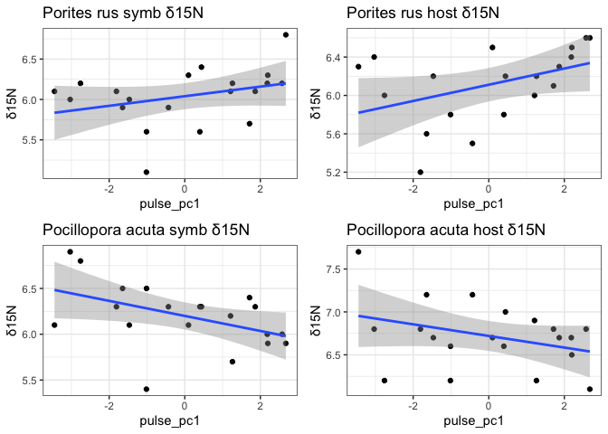

Coral Growth and Symbionts Analysis
================
Callie Stephenson
2023-08-29

## Introduction

This is a R Markdown file in which I hope to write out my analyses. I
will use this document to process all the R scripts found in the R
folder and complete my project.

#### Loading the data

NS Notes: Wants to do grams per grams (change in bw / initaial bw /
number of days) aka not multiplying by 100 to get percent change, but
dividing by time to get change in bw by day

``` r
turb1 <- turb %>% 
  filter(startsWith(CowTagID, "V")& CowTagID != "VSEEP")

turb1 <- turb1 %>%
  dplyr::select(c(CowTagID,
                   N_percent,
                   C_N))
#use C:N 
#can also use N percent
#plot(turb$C_N, turb$N_percent)
#hist(turb$C_N)
#hist(turb$N_percent)
#N_percent looks better. Will use N_percent for models
```

``` r
all_nut_long <- pivot_longer(
  data = all_nut,
  cols = c(Minimum_Salinity:Low_Tide_Mean_Ammonia_umolL)) 
names(all_nut_long)[names(all_nut_long) == "name"] <- "Parameter"

join <- explanatory_seasonal[,c(2:7)]
join <- unique(join)

explanatory_all <- left_join(join,all_nut_long, by = join_by(CowTagID))
explanatory_all_wide <- left_join(join, all_nut,by = join_by(CowTagID))
explanatory_all_wide <- left_join(explanatory_all_wide, turb1,by = join_by(CowTagID))
explanatory_all_wide <- left_join(explanatory_all_wide, PCA_Pulse_variables_wide,by = join_by(CowTagID))
```

``` r
#meta takes a little massaging
PAC_meta <- PAC_meta[,c(3:10)]
PAC_meta$Species <- "Pocillopora acuta"
PAC_meta$Genotype <- gsub('PR21', 'PA21', PAC_meta$Genotype) #fix a typo in the genotypes
PRU_meta <- PRU_meta[,c(2:9)]
PRU_meta$Species <- "Porites rus"

meta <- rbind(PAC_meta, PRU_meta)
meta$Cage_Uncaged <- ifelse(meta$Cage_Uncaged == "T0", meta$Cage_Uncaged, 
                            substr(meta$Placement_Code, nchar(meta$Placement_Code),
                                   nchar(meta$Placement_Code)))
meta$Cage_Uncaged <- as.factor(meta$Cage_Uncaged)
```

``` r
SI <- SI[,c(1:6)] #remove random extra columns
# Create a new column 'HS' containing the last 4 characters of 'Sample.ID'
SI$HS <- substr(SI$Sample.ID, nchar(SI$Sample.ID) - 3, nchar(SI$Sample.ID))

# Create a new column 'Sample.ID' containing all characters except the last 4 characters
SI$Sample.ID <- substr(SI$Sample.ID, 1, nchar(SI$Sample.ID) - 5)
SI$δ15N <- SI$δ15N...........vs..AIR.
SI$δ13C <- SI$δ13C............vs..VPDB

# Now your_data contains 'Sample.ID' split into two columns 'Sample.ID' and 'HS'
SI_cleaner <- SI[SI$Sample.ID != "", ]

SI_cleaner <- SI_cleaner %>%
  rename(`Micro_Vial` = Sample.ID)

SI_meta <- left_join(SI_cleaner, meta, by = join_by(Micro_Vial))
SI_meta$Genotype[is.na(SI_meta$Genotype)] <- SI_meta$Micro_Vial[is.na(SI_meta$Genotype)]
SI_meta$CowTagID <- paste0("V", SI_meta$Pin_Number)

CV <- names(explanatory_all_wide)[grepl("CV_", names(explanatory_all_wide), names(explanatory_all_wide))]
mean_low <- names(explanatory_all_wide)[grepl("Low_Tide_Mean_", names(explanatory_all_wide), names(explanatory_all_wide))]

filter_values <- c(CV, mean_low)

SI_data <- left_join(SI_meta, explanatory_all,by = join_by(CowTagID))
SI_data_wide <- left_join(SI_meta, explanatory_all_wide,by = join_by(CowTagID))

# Filter the dataframe SI_data
SI_data <- SI_data[SI_data$Parameter %in% filter_values, ] 
```

``` r
#now make an all data that has both explanatory and response variables:
all_data_seasonal <- left_join(response_data, explanatory_seasonal, by = join_by(CowTagID))
#suppress warnings because there will be a many-to-many relationship between x and y
all_data_seasonal$Genotype <- as.factor(all_data_seasonal$Genotype)
all_PAC_data_seasonal <- all_data_seasonal %>% 
  filter(Species == "Pocillopora acuta")
```

``` r
#now make an all data that has both explanatory and response variables:
all_data <- left_join(response_data, explanatory_all, by = join_by(CowTagID))
#suppress warnings because there will be a many-to-many relationship between x and y
all_data$Genotype <- as.factor(all_data$Genotype)
all_PAC_data <- all_data %>% 
  filter(Species == "Pocillopora acuta")

all_data_wide <- left_join(response_data, explanatory_all_wide, by = join_by(CowTagID))
```

``` r
minimum_columns <- names(all_data_wide)[grepl("Minimum_", names(all_data_wide)) & 
                                     grepl("Salinity|Temperature|pH", names(all_data_wide))]
#LOOK OUT YOU CHANGED THIS ON APRIL 17
maximum_columns <- names(all_data_wide)[grepl("Maximum_", names(all_data_wide)) & 
                                  !grepl("Salinity|Temperature|Ammonia_umol",names(all_data_wide))]
#mean_columns <- names(all_data_wide)[grepl("Mean_", names(all_data_wide)) & 
#                                  !grepl("Salinity|Temperature|pH|Ammonia_umol",names(all_data_wide))]
CV_columns <- names(all_data_wide)[grepl("CV_", names(all_data_wide), names(all_data_wide))]

mean_low_columns <- names(all_data_wide)[grepl("Low_Tide_Mean_", names(all_data_wide), names(all_data_wide))]

#PAC_model_data$CV_Salinity_scaled <- scale(PAC_model_data$CV_Salinity, TRUE, TRUE)
#PAC_model_data$CV_Temperature_scaled  <-  scale(PAC_model_data$CV_Temperature, TRUE, TRUE)
#PAC_model_data$CV_TA_scaled  <-  scale(PAC_model_data$CV_TA, TRUE, TRUE)
#PAC_model_data$CV_pH_scaled  <-  scale(PAC_model_data$CV_pH, TRUE, TRUE)
#PAC_model_data$Low_Tide_Mean_Phosphate_umolL_scaled<-
#  scale(PAC_model_data$Low_Tide_Mean_Phosphate_umolL, TRUE, TRUE)
#PAC_model_data$Low_Tide_Mean_NN_umolL_scaled  <-  
#  scale(PAC_model_data$Low_Tide_Mean_NN_umolL, TRUE, TRUE)
#PAC_model_data$Low_Tide_Mean_Ammonia_umolL_scaled  <-
#  scale(PAC_model_data$Low_Tide_Mean_Ammonia_umolL, TRUE, TRUE)
#PAC_model_data$Low_Tide_Mean_NNP_umolL_scaled <- 
#  scale(PAC_model_data$Low_Tide_Mean_Ammonia_umolL, TRUE, TRUE)


for (col in CV_columns) {
  scaled_variable <- paste0(col, "_scaled")
  scaled_values <- scale(all_data_wide[[col]], TRUE, TRUE)
  all_data_wide[[scaled_variable]] <- scaled_values[, 1]
}

for (col in mean_low_columns) {
  scaled_variable <- paste0(col, "_scaled")
  scaled_values <- scale(all_data_wide[[col]], TRUE, TRUE)
  all_data_wide[[scaled_variable]] <- scaled_values[, 1]
}

for (col in minimum_columns) {
  scaled_variable <- paste0(col, "_scaled")
  scaled_values <- scale(all_data_wide[[col]], TRUE, TRUE)
  all_data_wide[[scaled_variable]] <- scaled_values[, 1]
}

for (col in maximum_columns) {
  scaled_variable <- paste0(col, "_scaled")
  scaled_values <- scale(all_data_wide[[col]], TRUE, TRUE)
  all_data_wide[[scaled_variable]] <- scaled_values[, 1]
}

scaled_cv_columns <- names(all_data_wide)[grepl("^CV.*_scaled$", names(all_data_wide))]
scaled_ml_columns <- names(all_data_wide)[grepl("^Low.*_scaled$", names(all_data_wide))]
scaled_min_columns <- names(all_data_wide)[grepl("^Minimum.*_scaled$", names(all_data_wide))]
scaled_max_columns <- names(all_data_wide)[grepl("^Maximum.*_scaled$", names(all_data_wide))]

# Extract column names for filtering
selected_columns <- c("FSC.Events_per_cm_2", "Percent_Change", "Genotype", "Cage_Uncaged", "Species",
                      minimum_columns, 
                      maximum_columns,
                      CV_columns,
                      mean_low_columns,
                      scaled_min_columns, 
                      scaled_max_columns,
                      scaled_cv_columns,
                      scaled_ml_columns)


model_data <- all_data_wide[, selected_columns]


PAC_model_data <- na.omit(model_data %>% 
                            filter(Species == "Pocillopora acuta")) #%>%
# filter(Cage_Uncaged == "C")

PRU_model_data <- na.omit(model_data %>% 
        filter(Species == "Porites rus")) # %>% 
#  filter(Cage_Uncaged == "C")

dredge.data <- na.omit(model_data[, c(maximum_columns, 
                                    minimum_columns #,
#                                    mean_columns, #removed bc not enough data for the amount of variables
#                                    CV_columns,
#                      CV_columns,
#                      mean_low_columns,
#                      scaled_min_columns, 
#                      scaled_max_columns,
#                      scaled_cv_columns,
#                      scaled_ml_columns
)])
```

## Data Exploration:

Data exploration focuses on the following points: 1. Outliers 2.
Collinearity 3. Independence (Relationships between response and
explanatory variables)

<!-- -->

Ok so FSC.Events are both pretty right-skewed. CN says log10 transform
these.

    ## `geom_smooth()` using formula = 'y ~ x'

<!-- -->

    ## `geom_smooth()` using formula = 'y ~ x'

<!-- -->
Now, doing this again but for both seasons combined:

``` r
species <- unique(all_data$Species)
for (sp in species) {
  # Filter data for the current species and only caged
  species_data <- all_data %>%
    filter(Species == sp, Cage_Uncaged == "C")
  
  # Create plot for the current species
  plot <- species_data %>%
    ggplot(aes(x = value, y = Percent_Change)) +
    geom_point() +
    geom_smooth(method = "lm") +
    facet_wrap(~ Parameter, scales = "free_x") +
    ggtitle(paste(sp)) +  #Add species name to the plot title
    theme_bw()
  # Print and save the plot
  print(plot)
  #ggsave(filename = paste("output/raw_growth_data_response_plot_", sp, ".png", sep = ""),
  #       plot = plot, 
  #       width = 15, height = 15)
}
```

    ## `geom_smooth()` using formula = 'y ~ x'

<!-- -->

    ## `geom_smooth()` using formula = 'y ~ x'

<!-- -->

Same but let’s do for FCM data

    ## `geom_smooth()` using formula = 'y ~ x'
    ## `geom_smooth()` using formula = 'y ~ x'

<!-- -->

    ## `geom_smooth()` using formula = 'y ~ x'
    ## `geom_smooth()` using formula = 'y ~ x'

<!-- -->

And again, now for both seasons:

    ## `geom_smooth()` using formula = 'y ~ x'

<!-- -->

    ## `geom_smooth()` using formula = 'y ~ x'

<!-- -->

``` r
response_data %>% 
  filter(Cage_Uncaged == "C") %>% 
  ggplot(aes(y = Percent_Change, x = log10(FSC.Events_per_cm_2)))+
  geom_point() +
  ggtitle("Change in BW by Number of Symbionts") +
#  geom_text(aes(label = Pin_Number)) +
  facet_wrap(~ Species, scales = "free")
```

<!-- -->

``` r
BW_long <- response_data %>% 
  filter(Cage_Uncaged == "C") %>%
  dplyr::select(Species, Percent_Change,Pin_Number ) %>%
  group_by(Species, Pin_Number)%>%
  summarise(Percent_ChangeM  = mean(Percent_Change, na.rm = TRUE)) %>% 
  pivot_wider(names_from = "Species",
              values_from = "Percent_ChangeM")
```

    ## `summarise()` has grouped output by 'Species'. You can override using the
    ## `.groups` argument.

``` r
ggplot(data = BW_long, aes(x = `Pocillopora acuta`, y = `Porites rus`))+
  geom_point()
```

<!-- -->

``` r
ggplot(data = model_data, aes(x = Maximum_Silicate_umolL, y = Percent_Change))+
  geom_point()+
  geom_smooth(method = "lm", formula = "y~poly(x,2)") +
  facet_wrap(~Species)
```

    ## Warning: Removed 24 rows containing non-finite outside the scale range
    ## (`stat_smooth()`).

    ## Warning: Removed 24 rows containing missing values or values outside the scale range
    ## (`geom_point()`).

<!-- -->

#### Look for Outliers:

Buoyant Weight It looks like that 13 A is really off. We know it broke,
so I am removing it and replotted next to it:

Now making a plot to look at outliers:
<!-- --> I
removed PRU V13 A placement because this was broken in the field,
creating a large negative change in buoyant weight.

TLE <!-- -->

### Symbionts

<!-- --> Jess will rerun
PRU 49 (PRU V17 C) with her samples - I likely added twice as much as
needed to the sample, but for now I will omit in my analyses (using
dataframe FCM_no for “no outliers”)

``` r
ggplot(FCM, aes(x = Cage_Uncaged, y = log10(FSC.Events_per_cm_2), fill = Species)) +
  geom_violin() +
  geom_jitter(width = 0.2, height = 0, alpha = 0.5) +  # Adding jitter
  scale_fill_fish_d(option = "Acanthurus_olivaceus", alpha = 0.4, begin = 0.3, end = 1)+
  facet_wrap(~Species)+
  labs(title = expression(paste("Symbionts per ", cm^2, " by caging treatment")))+
  theme(plot.title = element_text(hjust = 0.5))
```

<!-- --> same
but other normalization:

``` r
ggplot(FCM, aes(x = Cage_Uncaged, y = log10(FSC.Events_per_g_dry_weight), fill = Species)) +
  geom_violin() +
  geom_jitter(width = 0.2, height = 0, alpha = 0.5) +  # Adding jitter
  scale_fill_fish_d(option = "Acanthurus_olivaceus", alpha = 0.4, begin = 0.3, end = 1) +
  facet_wrap(~Species)+
  labs(title = "Symbionts per g dry weight by caging treatment")+
  theme(plot.title = element_text(hjust = 0.5))
```

<!-- -->

### Collinearity

need to make a dataframe that’s long that has all the nutrient metrics
and independent variables Here’s the thing: we KNOW the nutrients are
collinear For example, here’s a pairs plot for the maximum of all the
nutrient values:

``` r
nut_wide_no_seep<- nut_wide[nut_wide$CowTagID != 'VSEEP', ]
maximum_columns <- names(nut_wide)[grepl("Maximum_", names(nut_wide)) & !grepl("Salinity|Temperature|pH|Ammonia_umol", names(nut_wide))]

ggpairs(nut_wide_no_seep[, c(maximum_columns)],progress = FALSE)
```

<!-- -->

### Independence

### Data Analysis

FCM Data Analysis:

    ##              Df    Sum Sq   Mean Sq F value Pr(>F)
    ## Cage_Uncaged  2 2.802e+08 140086728   0.596  0.555
    ## Residuals    56 1.317e+10 235216369

    ##              Df    Sum Sq  Mean Sq F value Pr(>F)
    ## Cage_Uncaged  2  16430837  8215419   0.659  0.521
    ## Residuals    56 697625032 12457590

### UNIVARIATE Growth Models

``` r
#make the PAC data frame longer
PAC_model_scaled_data_long <- pivot_longer(
  data = PAC_model_data[,c(1:5,32:57)],
  cols = c(Minimum_Salinity_scaled:Low_Tide_Mean_Ammonia_umolL_scaled)) 
names(PAC_model_scaled_data_long)[names(PAC_model_scaled_data_long) == "name"] <- "Parameter"

PAC_model_data_long <- pivot_longer(
  data = PAC_model_data[,c(1:5,6:31)],
  cols = c(Minimum_Salinity:Low_Tide_Mean_Ammonia_umolL)) 
names(PAC_model_data_long)[names(PAC_model_data_long) == "name"] <- "Parameter"


#make the PRU data frame longer
PRU_model_scaled_data_long <- pivot_longer(
  data = PRU_model_data[,c(1:5,32:57)],
  cols = c(Minimum_Salinity_scaled:Low_Tide_Mean_Ammonia_umolL_scaled)) 
names(PRU_model_scaled_data_long)[names(PRU_model_scaled_data_long) == "name"] <- "Parameter"

#lmer(y~poly(x,2) + (1|random effect)
```

``` r
model_results <- data.frame(Parameter = character(),
                            AICc = numeric(),
                            p.value = numeric(),
                            Estimate = numeric(),
                            stringsAsFactors = FALSE)

plotlist <- list()

parameters <- unique(PAC_model_scaled_data_long$Parameter)

for (parameter in parameters) {
  # Create a subset of data for the current parameter
  subset_data <- subset(PAC_model_scaled_data_long, Parameter == parameter)
  
  # Fit the mixed-effects model
  model <- lmer(Percent_Change ~ value + (1|Genotype) + (1|Cage_Uncaged), data = subset_data)
  
  # Get AICc and p-value
    AICc <- AICc(model)
  
  # Get p-value from summary
  model_summary <- summary(model)
  p.value <- model_summary$coefficients["value", "Pr(>|t|)"]
  Estimate <- model_summary$coefficients["value", "Estimate"]
  
if (p.value < 0.05) {
    # Add results to the dataframe
    model_results <- rbind(model_results, data.frame(Parameter = parameter,
                                                     AICc = AICc,
                                                     p.value = p.value,
                                                     Estimate = Estimate))
    
    # Create an effects plot using ggpredict
    effect_plot <- ggpredict(model, terms = "value[all]")
    
    # Extract the ggplot object from the ggpredict object
    ggplot_obj <- plot(effect_plot)
    
    # Add the ggplot object to the plotlist
    plotlist[[parameter]] <- ggplot_obj + ggtitle(parameter)
  }
  }
model_results %>% filter(p.value < 0.05)
```

    ##                              Parameter      AICc      p.value    Estimate
    ## 1                    Minimum_pH_scaled -160.9359 0.0041575798 -0.02024831
    ## 2                    Maximum_TA_scaled -156.3926 0.0459943288  0.01474211
    ## 3                         CV_TA_scaled -160.1149 0.0103590262  0.02245704
    ## 4                         CV_pH_scaled -166.3327 0.0002395223  0.02672431
    ## 5                   CV_NN_umolL_scaled -159.2549 0.0122003450 -0.01981100
    ## 6 Low_Tide_Mean_Phosphate_umolL_scaled -156.7719 0.0395927731  0.01400013

``` r
grid.arrange(grobs = plotlist, ncol = 2)
```

<!-- -->

``` r
model_results <- data.frame(Parameter = character(),
                            AICc = numeric(),
                            p.value = numeric(),
                            Estimate = numeric(),
                            stringsAsFactors = FALSE)

plotlist <- list()

parameters <- unique(PAC_model_scaled_data_long$Parameter)

for (parameter in parameters) {
  # Create a subset of data for the current parameter
  subset_data <- subset(PAC_model_scaled_data_long, Parameter == parameter)
  
  # Fit the mixed-effects model
  model <- lmer(log10(FSC.Events_per_cm_2) ~ value + (1|Genotype) + (1|Cage_Uncaged), data = subset_data)
  
  # Get AICc and p-value
    AICc <- AICc(model)
  
  # Get p-value from summary
  model_summary <- summary(model)
  p.value <- model_summary$coefficients["value", "Pr(>|t|)"]
  Estimate <- model_summary$coefficients["value", "Estimate"]
  
if (p.value < 0.05) {
    # Add results to the dataframe
    model_results <- rbind(model_results, data.frame(Parameter = parameter,
                                                     AICc = AICc,
                                                     p.value = p.value,
                                                     Estimate = Estimate))
    
    # Create an effects plot using ggpredict
    effect_plot <- ggpredict(model, terms = "value[all]")
    
    # Extract the ggplot object from the ggpredict object
    ggplot_obj <- plot(effect_plot)
    
    # Add the ggplot object to the plotlist
    plotlist[[parameter]] <- ggplot_obj + ggtitle(parameter)
  }
  }
model_results %>% filter(p.value < 0.05)
```

    ## [1] Parameter AICc      p.value   Estimate 
    ## <0 rows> (or 0-length row.names)

``` r
#grid.arrange(grobs = plotlist, ncol = 2)
```

So, nothing is changing the symbionts in acuta…

``` r
model_results <- data.frame(Parameter = character(),
                            AICc = numeric(),
                            p.value = numeric(),
                            Estimate = numeric(),
                            stringsAsFactors = FALSE)
plotlist <- list()

parameters <- unique(PRU_model_scaled_data_long$Parameter)

for (parameter in parameters) {
  # Create a subset of data for the current parameter
  subset_data <- subset(PRU_model_scaled_data_long, Parameter == parameter)
  
  # Fit the mixed-effects model
  model <- lmer(Percent_Change ~ value + (1|Genotype) + (1|Cage_Uncaged), data = subset_data)
  
  # Get AICc
  AICc <- AICc(model)
  
  # Get p-value from summary
  model_summary <- summary(model)
  p.value <- model_summary$coefficients["value", "Pr(>|t|)"]
  Estimate <- model_summary$coefficients["value", "Estimate"]
  
 if (p.value < 0.05) {
    # Add results to the dataframe
    model_results <- rbind(model_results, data.frame(Parameter = parameter,
                                                     AICc = AICc,
                                                     p.value = p.value,
                                                     Estimate = Estimate))
    
    # Create an effects plot using ggpredict
    effect_plot <- ggpredict(model, terms = "value[all]")
    
    # Extract the ggplot object from the ggpredict object
    ggplot_obj <- plot(effect_plot)
    
    # Add the ggplot object to the plotlist
    plotlist[[parameter]] <- ggplot_obj + ggtitle(parameter)
  }
  }
model_results %>% filter(p.value < 0.05)
```

    ##                            Parameter      AICc     p.value    Estimate
    ## 1                  Maximum_pH_scaled -127.6074 0.001129165  0.03031567
    ## 2            CV_Ammonia_umolL_scaled -124.1609 0.013527384 -0.02419060
    ## 3      Low_Tide_Mean_Salinity_scaled -127.6691 0.001094221  0.03043876
    ## 4   Low_Tide_Mean_Temperature_scaled -133.2880 0.000240322 -0.03726799
    ## 5 Low_Tide_Mean_Ammonia_umolL_scaled -122.9771 0.022798724 -0.02198357

``` r
grid.arrange(grobs = plotlist, ncol = 2)
```

<!-- -->

``` r
model_results <- data.frame(Parameter = character(),
                            AICc = numeric(),
                            p.value = numeric(),
                            Estimate = numeric(),
                            stringsAsFactors = FALSE)
plotlist <- list()

parameters <- unique(PRU_model_scaled_data_long$Parameter)

for (parameter in parameters) {
  # Create a subset of data for the current parameter
  subset_data <- subset(PRU_model_scaled_data_long, Parameter == parameter)
  
  # Fit the mixed-effects model
  model <- lmer(log10(FSC.Events_per_cm_2) ~ value + (1|Genotype) + Cage_Uncaged, data = subset_data)
  
  # Get AICc and p-value
    AICc <- AICc(model)
  
  # Get p-value from summary
  model_summary <- summary(model)
  p.value <- model_summary$coefficients["value", "Pr(>|t|)"]
  Estimate <- model_summary$coefficients["value", "Estimate"]
  
 if (p.value < 0.05) {
    # Add results to the dataframe
    model_results <- rbind(model_results, data.frame(Parameter = parameter,
                                                     AICc = AICc,
                                                     p.value = p.value,
                                                     Estimate = Estimate))
    
    # Create an effects plot using ggpredict
    effect_plot <- ggpredict(model, terms = "value[all]")
    
    # Extract the ggplot object from the ggpredict object
    ggplot_obj <- plot(effect_plot)
    
    # Add the ggplot object to the plotlist
    plotlist[[parameter]] <- ggplot_obj + ggtitle(parameter)
  }
  }
```

    ## Model has log-transformed response. Back-transforming predictions to
    ##   original response scale. Standard errors are still on the log-scale.
    ## Model has log-transformed response. Back-transforming predictions to
    ##   original response scale. Standard errors are still on the log-scale.

``` r
model_results %>% filter(p.value < 0.05)
```

    ##                              Parameter     AICc     p.value  Estimate
    ## 1       Maximum_Phosphate_umolL_scaled 60.15529 0.001901729 0.1413347
    ## 2 Low_Tide_Mean_Phosphate_umolL_scaled 61.21396 0.004417224 0.1298313

``` r
grid.arrange(grobs = plotlist, ncol = 2)
```

<!-- --> \####
Polynomial models lmer(y~poly(x,2) + (1\|random effect)

``` r
model_results <- data.frame(Parameter = character(),
                            AICc = numeric(),
                            p.value = numeric(),
                            Estimate = numeric(),
                            stringsAsFactors = FALSE)
plotlist <- list()

parameters <- unique(PAC_model_scaled_data_long$Parameter)

for (parameter in parameters) {
  # Create a subset of data for the current parameter
  subset_data <- subset(PAC_model_scaled_data_long, Parameter == parameter)
  
  # Fit the mixed-effects model
  model <- lmer(Percent_Change ~ poly(value,2) + (1|Genotype) + (1|Cage_Uncaged), data = subset_data)
  
  # Get AICc and p-value
  AICc <- AICc(model)
  
  # Get p-value from summary
  model_summary <- summary(model)
  p.value <- model_summary$coefficients["poly(value, 2)1", "Pr(>|t|)"]
  Estimate <- model_summary$coefficients["poly(value, 2)1", "Estimate"]
  
  if (p.value < 0.05) {
    # Add results to the dataframe
    model_results <- rbind(model_results, data.frame(Parameter = parameter,
                                                     AICc = AICc,
                                                     p.value = p.value,
                                                     Estimate = Estimate))
    
    # Create an effects plot using ggpredict
    effect_plot <- ggpredict(model, terms = "value[all]")
    
    # Extract the ggplot object from the ggpredict object
    ggplot_obj <- plot(effect_plot)
    
    # Add the ggplot object to the plotlist
    plotlist[[parameter]] <- ggplot_obj + ggtitle(parameter)
  }
  }

model_results %>% filter(p.value < 0.05)
```

    ##            Parameter      AICc      p.value   Estimate
    ## 1  Minimum_pH_scaled -158.2743 0.0044621671 -0.1495642
    ## 2  Maximum_TA_scaled -156.5120 0.0499662195  0.1100178
    ## 3       CV_TA_scaled -158.1861 0.0143094591  0.1684881
    ## 4       CV_pH_scaled -164.5757 0.0002458043  0.1955769
    ## 5 CV_NN_umolL_scaled -156.9627 0.0142634624 -0.1527786

``` r
grid.arrange(grobs = plotlist, ncol = 1)
```

<!-- -->

``` r
model_results <- data.frame(Parameter = character(),
                            AICc = numeric(),
                            p.value = numeric(),
                            Estimate = numeric(),
                            stringsAsFactors = FALSE)
plotlist <- list()

parameters <- unique(PAC_model_scaled_data_long$Parameter)

for (parameter in parameters) {
  # Create a subset of data for the current parameter
  subset_data <- subset(PAC_model_scaled_data_long, Parameter == parameter)

  # Fit the mixed-effects model
  model <- lmer(log10(FSC.Events_per_cm_2) ~ poly(value,2) + (1|Genotype) + (1|Cage_Uncaged), data = subset_data)
  
  # Get AICc and p-value
  AICc <- AICc(model)
  
  # Get p-value from summary
  model_summary <- summary(model)
  p.value <- model_summary$coefficients["poly(value, 2)1", "Pr(>|t|)"]
  Estimate <- model_summary$coefficients["poly(value, 2)1", "Estimate"]
  
  if (p.value < 0.05) {
    # Add results to the dataframe
    model_results <- rbind(model_results, data.frame(Parameter = parameter,
                                                     AICc = AICc,
                                                     p.value = p.value,
                                                     Estimate = Estimate))
    
    # Create an effects plot using ggpredict
    effect_plot <- ggpredict(model, terms = "value")
    
    # Extract the ggplot object from the ggpredict object
    ggplot_obj <- plot(effect_plot)
    
    # Add the ggplot object to the plotlist
    plotlist[[parameter]] <- ggplot_obj + ggtitle(parameter)
  }
  }

model_results %>% filter(p.value < 0.05)
```

    ## [1] Parameter AICc      p.value   Estimate 
    ## <0 rows> (or 0-length row.names)

``` r
#grid.arrange(grobs = plotlist, ncol = 1)
```

So, nothing is changing the symbionts in acuta…

``` r
model_results <- data.frame(Parameter = character(),
                            AICc = numeric(),
                            p.value = numeric(),
                            Estimate = numeric(),
                            stringsAsFactors = FALSE)
plotlist <- list()

parameters <- unique(PRU_model_scaled_data_long$Parameter)

for (parameter in parameters) {
  # Create a subset of data for the current parameter
  subset_data <- subset(PRU_model_scaled_data_long, Parameter == parameter)
  
  # Fit the mixed-effects model
  model <- lmer(Percent_Change ~ poly(value,2) + (1|Genotype) + (1|Cage_Uncaged), data = subset_data)
  
  # Get AICc and p-value
  AICc <- AICc(model)
  
  # Get p-value from summary
  model_summary <- summary(model)
  p.value <- model_summary$coefficients["poly(value, 2)1", "Pr(>|t|)"]
  Estimate <- model_summary$coefficients["poly(value, 2)1", "Estimate"]
  
  if (p.value < 0.05) {
    # Add results to the dataframe
    model_results <- rbind(model_results, data.frame(Parameter = parameter,
                                                     AICc = AICc,
                                                     p.value = p.value,
                                                     Estimate = Estimate))
    
    # Create an effects plot using ggpredict
    effect_plot <- ggpredict(model, terms = "value")
    
    # Extract the ggplot object from the ggpredict object
    ggplot_obj <- plot(effect_plot)
    
    # Add the ggplot object to the plotlist
    plotlist[[parameter]] <- ggplot_obj + ggtitle(parameter)
  }
  }

model_results %>% filter(p.value < 0.05)
```

    ##                            Parameter      AICc      p.value   Estimate
    ## 1                  Maximum_pH_scaled -125.7759 0.0017435700  0.2326255
    ## 2                 CV_Salinity_scaled -129.7275 0.0355663398  0.1429684
    ## 3            CV_Ammonia_umolL_scaled -122.5461 0.0136048339 -0.1876923
    ## 4      Low_Tide_Mean_Salinity_scaled -132.0381 0.0006667430  0.2342873
    ## 5   Low_Tide_Mean_Temperature_scaled -131.3474 0.0003529414 -0.2880410
    ## 6 Low_Tide_Mean_Ammonia_umolL_scaled -121.5113 0.0208896736 -0.1732883

``` r
grid.arrange(grobs = plotlist, ncol = 1)
```

<!-- -->

``` r
model_results <- data.frame(Parameter = character(),
                            AICc = numeric(),
                            p.value = numeric(),
                            Estimate = numeric(),
                            stringsAsFactors = FALSE)

plotlist <- list()

parameters <- unique(PRU_model_scaled_data_long$Parameter)

for (parameter in parameters) {
  # Create a subset of data for the current parameter
  subset_data <- subset(PRU_model_scaled_data_long, Parameter == parameter)
  
  # Fit the mixed-effects model
  model <- lmer(log10(FSC.Events_per_cm_2) ~ poly(value,2) + (1|Genotype) + (1|Cage_Uncaged), data = subset_data)
  
  # Get AICc and p-value
  AICc <- AICc(model)
  
  # Get p-value from summary
  model_summary <- summary(model)
  p.value <- model_summary$coefficients["poly(value, 2)1", "Pr(>|t|)"]
  Estimate <- model_summary$coefficients["poly(value, 2)1", "Estimate"]
  
  if (p.value < 0.05) {
    # Add results to the dataframe
    model_results <- rbind(model_results, data.frame(Parameter = parameter,
                                                     AICc = AICc,
                                                     p.value = p.value,
                                                     Estimate = Estimate))
    
    # Create an effects plot using ggpredict
    effect_plot <- ggpredict(model, terms = "value")
    
    # Extract the ggplot object from the ggpredict object
    ggplot_obj <- plot(effect_plot)
    
    # Add the ggplot object to the plotlist
    plotlist[[parameter]] <- ggplot_obj + ggtitle(parameter)
  }
  }

model_results %>% filter(p.value < 0.05)
```

    ##                              Parameter     AICc     p.value  Estimate
    ## 1       Maximum_Phosphate_umolL_scaled 51.03899 0.002210668 1.0681375
    ## 2 Low_Tide_Mean_Phosphate_umolL_scaled 48.32719 0.005172355 0.9392301

``` r
grid.arrange(grobs = plotlist, ncol = 1)
```

<!-- -->

#### Dredged data models (aka is multiresponse better than univariate models)

``` r
ggpairs(PAC_model_data, columns = c("CV_Salinity_scaled",  
                       "CV_Temperature_scaled",  
                       "CV_TA_scaled",  
                       "CV_pH_scaled"), progress = FALSE)
```

<!-- -->

``` r
ggpairs(PAC_model_data, columns = c("Low_Tide_Mean_Phosphate_umolL",  
                       "Low_Tide_Mean_NN_umolL", 
                       "Low_Tide_Mean_Ammonia_umolL",
                       "Low_Tide_Mean_NNP_umolL"), progress = FALSE)
```

<!-- -->

Extra exploratory plots:

``` r
PAC_model_data_long <- pivot_longer(
  data = PAC_model_data,
  cols = c("Low_Tide_Mean_Phosphate_umolL",  
                       "Low_Tide_Mean_NN_umolL", 
                       "Low_Tide_Mean_Ammonia_umolL",
                       "Low_Tide_Mean_NNP_umolL",
           "CV_Salinity_scaled",  
                       "CV_Temperature_scaled",  
                       "CV_TA_scaled",  
                       "CV_pH_scaled"),
  names_to = "Parameter",
  values_to = "Value")

ggplot(PAC_model_data_long, aes(x = Value, y = Percent_Change)) +
    geom_point() +
    geom_smooth(method = "lm") +
    facet_wrap(~ Parameter, scales = "free") +
    theme_bw()
```

    ## `geom_smooth()` using formula = 'y ~ x'

<!-- -->

``` r
ggplot(PAC_model_data_long, aes(x = Value, y = FSC.Events_per_cm_2)) +
    geom_point() +
    geom_smooth(method = "lm") +
    facet_wrap(~ Parameter, scales = "free") +
    theme_bw()
```

    ## `geom_smooth()` using formula = 'y ~ x'

<!-- -->

``` r
#PAC_cv_model <- glm(Percent_Change ~ ., data = PAC_cv_model_data, na.action = na.pass)
#the above line works if you only include response and explanatory in the dataframe, but dredge can't handle it with random effects

# Build the GLM model
#PAC_cv_model <- glm(Percent_Change ~ ., data = PAC_cv_model_data, na.action = na.pass)
PAC_cv_low_growth_model <- lmer(Percent_Change ~ 
                       CV_Salinity_scaled + 
                       CV_Temperature_scaled + 
                       CV_TA_scaled + 
                       CV_pH_scaled +
                       Low_Tide_Mean_Phosphate_umolL_scaled + 
                       Low_Tide_Mean_NN_umolL_scaled + 
                       Low_Tide_Mean_Ammonia_umolL_scaled +
                       Low_Tide_Mean_NNP_umolL_scaled +
                       (1 | Genotype), 
                                 data = PAC_model_data, 
                                 na.action = na.pass)

PAC_cv_low_growth_model_dredge <- dredge(PAC_cv_low_growth_model, trace = 2)
```

    ##   |                                                                              |                                                                      |   0%  |                                                                              |=                                                                     |   1%  |                                                                              |=                                                                     |   2%  |                                                                              |==                                                                    |   2%  |                                                                              |==                                                                    |   3%  |                                                                              |==                                                                    |   4%  |                                                                              |===                                                                   |   4%  |                                                                              |===                                                                   |   5%  |                                                                              |====                                                                  |   5%  |                                                                              |====                                                                  |   6%  |                                                                              |=====                                                                 |   7%  |                                                                              |=====                                                                 |   8%  |                                                                              |======                                                                |   8%  |                                                                              |======                                                                |   9%  |                                                                              |=======                                                               |   9%  |                                                                              |=======                                                               |  10%  |                                                                              |=======                                                               |  11%  |                                                                              |========                                                              |  11%  |                                                                              |========                                                              |  12%  |                                                                              |=========                                                             |  12%  |                                                                              |=========                                                             |  13%  |                                                                              |==========                                                            |  14%  |                                                                              |==========                                                            |  15%  |                                                                              |===========                                                           |  15%  |                                                                              |===========                                                           |  16%  |                                                                              |============                                                          |  17%  |                                                                              |============                                                          |  18%  |                                                                              |=============                                                         |  18%  |                                                                              |=============                                                         |  19%  |                                                                              |==============                                                        |  20%  |                                                                              |==============                                                        |  21%  |                                                                              |===============                                                       |  21%  |                                                                              |===============                                                       |  22%  |                                                                              |================                                                      |  22%  |                                                                              |================                                                      |  23%  |                                                                              |=================                                                     |  24%  |                                                                              |=================                                                     |  25%  |                                                                              |==================                                                    |  25%  |                                                                              |==================                                                    |  26%  |                                                                              |===================                                                   |  27%  |                                                                              |===================                                                   |  28%  |                                                                              |====================                                                  |  28%  |                                                                              |====================                                                  |  29%  |                                                                              |=====================                                                 |  29%  |                                                                              |=====================                                                 |  30%  |                                                                              |======================                                                |  31%  |                                                                              |======================                                                |  32%  |                                                                              |=======================                                               |  32%  |                                                                              |=======================                                               |  33%  |                                                                              |========================                                              |  34%  |                                                                              |========================                                              |  35%  |                                                                              |=========================                                             |  35%  |                                                                              |=========================                                             |  36%  |                                                                              |==========================                                            |  37%  |                                                                              |==========================                                            |  38%  |                                                                              |===========================                                           |  38%  |                                                                              |===========================                                           |  39%  |                                                                              |============================                                          |  39%  |                                                                              |============================                                          |  40%  |                                                                              |============================                                          |  41%  |                                                                              |=============================                                         |  41%  |                                                                              |=============================                                         |  42%  |                                                                              |==============================                                        |  42%  |                                                                              |==============================                                        |  43%  |                                                                              |===============================                                       |  44%  |                                                                              |===============================                                       |  45%  |                                                                              |================================                                      |  45%  |                                                                              |================================                                      |  46%  |                                                                              |=================================                                     |  46%  |                                                                              |=================================                                     |  47%  |                                                                              |=================================                                     |  48%  |                                                                              |==================================                                    |  48%  |                                                                              |==================================                                    |  49%  |                                                                              |===================================                                   |  50%  |                                                                              |====================================                                  |  51%  |                                                                              |====================================                                  |  52%  |                                                                              |=====================================                                 |  52%  |                                                                              |=====================================                                 |  53%  |                                                                              |=====================================                                 |  54%  |                                                                              |======================================                                |  54%  |                                                                              |======================================                                |  55%  |                                                                              |=======================================                               |  55%  |                                                                              |=======================================                               |  56%  |                                                                              |========================================                              |  57%  |                                                                              |========================================                              |  58%  |                                                                              |=========================================                             |  58%  |                                                                              |=========================================                             |  59%  |                                                                              |==========================================                            |  59%  |                                                                              |==========================================                            |  60%  |                                                                              |==========================================                            |  61%  |                                                                              |===========================================                           |  61%  |                                                                              |===========================================                           |  62%  |                                                                              |============================================                          |  62%  |                                                                              |============================================                          |  63%  |                                                                              |=============================================                         |  64%  |                                                                              |=============================================                         |  65%  |                                                                              |==============================================                        |  65%  |                                                                              |==============================================                        |  66%  |                                                                              |===============================================                       |  67%  |                                                                              |===============================================                       |  68%  |                                                                              |================================================                      |  68%  |                                                                              |================================================                      |  69%  |                                                                              |=================================================                     |  70%  |                                                                              |=================================================                     |  71%  |                                                                              |==================================================                    |  71%  |                                                                              |==================================================                    |  72%  |                                                                              |===================================================                   |  72%  |                                                                              |===================================================                   |  73%  |                                                                              |====================================================                  |  74%  |                                                                              |====================================================                  |  75%  |                                                                              |=====================================================                 |  75%  |                                                                              |=====================================================                 |  76%  |                                                                              |======================================================                |  77%  |                                                                              |======================================================                |  78%  |                                                                              |=======================================================               |  78%  |                                                                              |=======================================================               |  79%  |                                                                              |========================================================              |  79%  |                                                                              |========================================================              |  80%  |                                                                              |=========================================================             |  81%  |                                                                              |=========================================================             |  82%  |                                                                              |==========================================================            |  82%  |                                                                              |==========================================================            |  83%  |                                                                              |===========================================================           |  84%  |                                                                              |===========================================================           |  85%  |                                                                              |============================================================          |  85%  |                                                                              |============================================================          |  86%  |                                                                              |=============================================================         |  87%  |                                                                              |=============================================================         |  88%  |                                                                              |==============================================================        |  88%  |                                                                              |==============================================================        |  89%  |                                                                              |===============================================================       |  89%  |                                                                              |===============================================================       |  90%  |                                                                              |===============================================================       |  91%  |                                                                              |================================================================      |  91%  |                                                                              |================================================================      |  92%  |                                                                              |=================================================================     |  92%  |                                                                              |=================================================================     |  93%  |                                                                              |==================================================================    |  94%  |                                                                              |==================================================================    |  95%  |                                                                              |===================================================================   |  95%  |                                                                              |===================================================================   |  96%  |                                                                              |====================================================================  |  96%  |                                                                              |====================================================================  |  97%  |                                                                              |====================================================================  |  98%  |                                                                              |===================================================================== |  98%  |                                                                              |===================================================================== |  99%  |                                                                              |======================================================================| 100%

``` r
#model.sel(PAC_cv_low_growth_model_dredge)
PAC.avg_cv_low_growth_model = model.avg(PAC_cv_low_growth_model_dredge, delta < 5)
summary(PAC.avg_cv_low_growth_model)
```

    ## 
    ## Call:
    ## model.avg(object = PAC_cv_low_growth_model_dredge, subset = delta < 
    ##     5)
    ## 
    ## Component model call: 
    ## lmer(formula = Percent_Change ~ <7 unique rhs>, data = PAC_model_data, 
    ##      na.action = na.pass)
    ## 
    ## Component models: 
    ##        df logLik    AICc delta weight
    ## 1       4  88.61 -168.48  0.00   0.45
    ## 12      5  88.80 -166.47  2.01   0.16
    ## 13      5  88.59 -166.05  2.43   0.13
    ## 123     6  89.44 -165.27  3.21   0.09
    ## (Null)  3  85.79 -165.14  3.34   0.08
    ## 14      5  87.42 -163.71  4.77   0.04
    ## 124     6  88.56 -163.51  4.97   0.04
    ## 
    ## Term codes: 
    ##                       CV_pH_scaled                       CV_TA_scaled 
    ##                                  1                                  2 
    ##              CV_Temperature_scaled Low_Tide_Mean_Ammonia_umolL_scaled 
    ##                                  3                                  4 
    ## 
    ## Model-averaged coefficients:  
    ## (full average) 
    ##                                     Estimate Std. Error Adjusted SE z value
    ## (Intercept)                         0.103388   0.011368    0.011625   8.893
    ## CV_pH_scaled                        0.026204   0.010511    0.010600   2.472
    ## CV_TA_scaled                        0.006680   0.011143    0.011177   0.598
    ## CV_Temperature_scaled               0.004040   0.008015    0.008036   0.503
    ## Low_Tide_Mean_Ammonia_umolL_scaled -0.001244   0.004568    0.004582   0.272
    ##                                    Pr(>|z|)    
    ## (Intercept)                          <2e-16 ***
    ## CV_pH_scaled                         0.0134 *  
    ## CV_TA_scaled                         0.5500    
    ## CV_Temperature_scaled                0.6151    
    ## Low_Tide_Mean_Ammonia_umolL_scaled   0.7859    
    ##  
    ## (conditional average) 
    ##                                     Estimate Std. Error Adjusted SE z value
    ## (Intercept)                         0.103388   0.011368    0.011625   8.893
    ## CV_pH_scaled                        0.028622   0.007174    0.007316   3.912
    ## CV_TA_scaled                        0.022872   0.007403    0.007573   3.020
    ## CV_Temperature_scaled               0.018070   0.005810    0.005944   3.040
    ## Low_Tide_Mean_Ammonia_umolL_scaled -0.015797   0.005915    0.006050   2.611
    ##                                    Pr(>|z|)    
    ## (Intercept)                         < 2e-16 ***
    ## CV_pH_scaled                       9.14e-05 ***
    ## CV_TA_scaled                        0.00252 ** 
    ## CV_Temperature_scaled               0.00236 ** 
    ## Low_Tide_Mean_Ammonia_umolL_scaled  0.00902 ** 
    ## ---
    ## Signif. codes:  0 '***' 0.001 '**' 0.01 '*' 0.05 '.' 0.1 ' ' 1

``` r
PAC.avg_cv_low_growth_model$sw
```

    ##                      CV_pH_scaled CV_TA_scaled CV_Temperature_scaled
    ## Sum of weights:      0.92         0.29         0.22                 
    ## N containing models:    6            3            2                 
    ##                      Low_Tide_Mean_Ammonia_umolL_scaled
    ## Sum of weights:      0.08                              
    ## N containing models:    2

Make the effects plots for the model with the most support:

``` r
PAC_growth_cv_plus_lowtide_model <- lmer(Percent_Change ~ 
#                       CV_Salinity_scaled + 
#                       CV_Temperature_scaled + 
                       CV_TA_scaled + 
#                       CV_pH_scaled +
                       (1 | Genotype), 
                                 data = PAC_model_data, 
                                 na.action = na.pass)
plot(allEffects(PAC_growth_cv_plus_lowtide_model))
```

<!-- -->

# April 17 Minimum Maximum models aka extremes drive change

``` r
#PAC_cv_model <- glm(Percent_Change ~ ., data = PAC_cv_model_data, na.action = na.pass)
#the above line works if you only include response and explanatory in the dataframe, but dredge can't handle it with random effects

# Build the GLM model
#PAC_cv_model <- glm(Percent_Change ~ ., data = PAC_cv_model_data, na.action = na.pass)
PAC_cv_minmax_growth_model <- lmer(Percent_Change ~ 
                       Minimum_Salinity_scaled + 
                       Minimum_Temperature_scaled + 
                       Maximum_TA_scaled + 
                       Minimum_pH_scaled +
                       Maximum_NN_umolL_scaled + 
                       Maximum_Phosphate_umolL_scaled + 
                       Maximum_NNP_umolL_scaled +
                       (1 | Genotype), 
                                 data = PAC_model_data, 
                                 na.action = na.pass)

PAC_cv_minmax_growth_model_dredge <- dredge(PAC_cv_minmax_growth_model, trace = 2)
```

    ##   |                                                                              |                                                                      |   0%  |                                                                              |=                                                                     |   1%  |                                                                              |=                                                                     |   2%  |                                                                              |==                                                                    |   2%  |                                                                              |==                                                                    |   3%  |                                                                              |===                                                                   |   4%  |                                                                              |===                                                                   |   5%  |                                                                              |====                                                                  |   5%  |                                                                              |====                                                                  |   6%  |                                                                              |=====                                                                 |   7%  |                                                                              |=====                                                                 |   8%  |                                                                              |======                                                                |   9%  |                                                                              |=======                                                               |   9%  |                                                                              |=======                                                               |  10%  |                                                                              |========                                                              |  11%  |                                                                              |========                                                              |  12%  |                                                                              |=========                                                             |  12%  |                                                                              |=========                                                             |  13%  |                                                                              |==========                                                            |  14%  |                                                                              |==========                                                            |  15%  |                                                                              |===========                                                           |  16%  |                                                                              |============                                                          |  17%  |                                                                              |=============                                                         |  18%  |                                                                              |=============                                                         |  19%  |                                                                              |==============                                                        |  20%  |                                                                              |===============                                                       |  21%  |                                                                              |===============                                                       |  22%  |                                                                              |================                                                      |  23%  |                                                                              |=================                                                     |  24%  |                                                                              |==================                                                    |  25%  |                                                                              |==================                                                    |  26%  |                                                                              |===================                                                   |  27%  |                                                                              |====================                                                  |  28%  |                                                                              |====================                                                  |  29%  |                                                                              |=====================                                                 |  30%  |                                                                              |======================                                                |  31%  |                                                                              |======================                                                |  32%  |                                                                              |=======================                                               |  33%  |                                                                              |========================                                              |  34%  |                                                                              |=========================                                             |  35%  |                                                                              |=========================                                             |  36%  |                                                                              |==========================                                            |  37%  |                                                                              |==========================                                            |  38%  |                                                                              |===========================                                           |  38%  |                                                                              |===========================                                           |  39%  |                                                                              |============================                                          |  40%  |                                                                              |============================                                          |  41%  |                                                                              |=============================                                         |  41%  |                                                                              |==============================                                        |  42%  |                                                                              |==============================                                        |  43%  |                                                                              |===============================                                       |  44%  |                                                                              |===============================                                       |  45%  |                                                                              |================================                                      |  45%  |                                                                              |================================                                      |  46%  |                                                                              |=================================                                     |  47%  |                                                                              |=================================                                     |  48%  |                                                                              |==================================                                    |  48%  |                                                                              |==================================                                    |  49%  |                                                                              |===================================                                   |  50%  |                                                                              |====================================                                  |  51%  |                                                                              |====================================                                  |  52%  |                                                                              |=====================================                                 |  52%  |                                                                              |=====================================                                 |  53%  |                                                                              |======================================                                |  54%  |                                                                              |======================================                                |  55%  |                                                                              |=======================================                               |  55%  |                                                                              |=======================================                               |  56%  |                                                                              |========================================                              |  57%  |                                                                              |========================================                              |  58%  |                                                                              |=========================================                             |  59%  |                                                                              |==========================================                            |  59%  |                                                                              |==========================================                            |  60%  |                                                                              |===========================================                           |  61%  |                                                                              |===========================================                           |  62%  |                                                                              |============================================                          |  62%  |                                                                              |============================================                          |  63%  |                                                                              |=============================================                         |  64%  |                                                                              |=============================================                         |  65%  |                                                                              |==============================================                        |  66%  |                                                                              |===============================================                       |  67%  |                                                                              |================================================                      |  68%  |                                                                              |================================================                      |  69%  |                                                                              |=================================================                     |  70%  |                                                                              |==================================================                    |  71%  |                                                                              |==================================================                    |  72%  |                                                                              |===================================================                   |  73%  |                                                                              |====================================================                  |  74%  |                                                                              |====================================================                  |  75%  |                                                                              |=====================================================                 |  76%  |                                                                              |======================================================                |  77%  |                                                                              |=======================================================               |  78%  |                                                                              |=======================================================               |  79%  |                                                                              |========================================================              |  80%  |                                                                              |=========================================================             |  81%  |                                                                              |=========================================================             |  82%  |                                                                              |==========================================================            |  83%  |                                                                              |===========================================================           |  84%  |                                                                              |============================================================          |  85%  |                                                                              |============================================================          |  86%  |                                                                              |=============================================================         |  87%  |                                                                              |=============================================================         |  88%  |                                                                              |==============================================================        |  88%  |                                                                              |==============================================================        |  89%  |                                                                              |===============================================================       |  90%  |                                                                              |===============================================================       |  91%  |                                                                              |================================================================      |  91%  |                                                                              |=================================================================     |  92%  |                                                                              |=================================================================     |  93%  |                                                                              |==================================================================    |  94%  |                                                                              |==================================================================    |  95%  |                                                                              |===================================================================   |  95%  |                                                                              |===================================================================   |  96%  |                                                                              |====================================================================  |  97%  |                                                                              |====================================================================  |  98%  |                                                                              |===================================================================== |  98%  |                                                                              |===================================================================== |  99%

``` r
#model.sel(PAC_cv_low_growth_model_dredge)
PAC.avg_minmax_growth_model = model.avg(PAC_cv_minmax_growth_model_dredge, delta < 10)
summary(PAC.avg_minmax_growth_model)
```

    ## 
    ## Call:
    ## model.avg(object = PAC_cv_minmax_growth_model_dredge, subset = delta < 
    ##     10)
    ## 
    ## Component model call: 
    ## lmer(formula = Percent_Change ~ <8 unique rhs>, data = PAC_model_data, 
    ##      na.action = na.pass)
    ## 
    ## Component models: 
    ##        df logLik    AICc delta weight
    ## (Null)  3  85.79 -165.14  0.00   0.52
    ## 35      5  87.37 -163.61  1.52   0.24
    ## 3       4  85.93 -163.11  2.02   0.19
    ## 2       4  83.65 -158.56  6.57   0.02
    ## 1       4  82.70 -156.65  8.48   0.01
    ## 235     6  85.05 -156.49  8.64   0.01
    ## 345     6  84.84 -156.07  9.07   0.01
    ## 5       4  82.09 -155.45  9.69   0.00
    ## 
    ## Term codes: 
    ## Maximum_Phosphate_umolL_scaled              Maximum_TA_scaled 
    ##                              1                              2 
    ##              Minimum_pH_scaled        Minimum_Salinity_scaled 
    ##                              3                              4 
    ##     Minimum_Temperature_scaled 
    ##                              5 
    ## 
    ## Model-averaged coefficients:  
    ## (full average) 
    ##                                  Estimate Std. Error Adjusted SE z value
    ## (Intercept)                     1.027e-01  1.120e-02   1.145e-02   8.967
    ## Minimum_pH_scaled              -1.302e-02  1.611e-02   1.614e-02   0.807
    ## Minimum_Temperature_scaled     -6.979e-03  1.248e-02   1.251e-02   0.558
    ## Maximum_TA_scaled               3.834e-04  2.608e-03   2.620e-03   0.146
    ## Maximum_Phosphate_umolL_scaled  7.699e-05  1.086e-03   1.095e-03   0.070
    ## Minimum_Salinity_scaled         7.162e-05  1.101e-03   1.107e-03   0.065
    ##                                Pr(>|z|)    
    ## (Intercept)                      <2e-16 ***
    ## Minimum_pH_scaled                 0.420    
    ## Minimum_Temperature_scaled        0.577    
    ## Maximum_TA_scaled                 0.884    
    ## Maximum_Phosphate_umolL_scaled    0.944    
    ## Minimum_Salinity_scaled           0.948    
    ##  
    ## (conditional average) 
    ##                                 Estimate Std. Error Adjusted SE z value
    ## (Intercept)                     0.102700   0.011203    0.011453   8.967
    ## Minimum_pH_scaled              -0.029177   0.010496    0.010613   2.749
    ## Minimum_Temperature_scaled     -0.026770   0.008212    0.008379   3.195
    ## Maximum_TA_scaled               0.014490   0.007249    0.007412   1.955
    ## Maximum_Phosphate_umolL_scaled  0.010242   0.007274    0.007437   1.377
    ## Minimum_Salinity_scaled         0.012761   0.007347    0.007519   1.697
    ##                                Pr(>|z|)    
    ## (Intercept)                     < 2e-16 ***
    ## Minimum_pH_scaled               0.00597 ** 
    ## Minimum_Temperature_scaled      0.00140 ** 
    ## Maximum_TA_scaled               0.05060 .  
    ## Maximum_Phosphate_umolL_scaled  0.16849    
    ## Minimum_Salinity_scaled         0.08967 .  
    ## ---
    ## Signif. codes:  0 '***' 0.001 '**' 0.01 '*' 0.05 '.' 0.1 ' ' 1

``` r
PAC.avg_minmax_growth_model$sw
```

    ##                      Minimum_pH_scaled Minimum_Temperature_scaled
    ## Sum of weights:       0.45              0.26                     
    ## N containing models:     4                 4                     
    ##                      Maximum_TA_scaled Maximum_Phosphate_umolL_scaled
    ## Sum of weights:       0.03             <0.01                         
    ## N containing models:     2                 1                         
    ##                      Minimum_Salinity_scaled
    ## Sum of weights:      <0.01                  
    ## N containing models:     1

``` r
PRU_cv_minmax_growth_model <- lmer(Percent_Change ~ 
                       Minimum_Salinity_scaled + 
                       Minimum_Temperature_scaled + 
                       Maximum_TA_scaled + 
                       Minimum_pH_scaled +
                       Maximum_NN_umolL_scaled + 
                       Maximum_Phosphate_umolL_scaled + 
                       Maximum_NNP_umolL_scaled +
                       (1 | Genotype), 
                                 data = PRU_model_data, 
                                 na.action = na.pass)

PRU_cv_minmax_growth_model_dredge <- dredge(PRU_cv_minmax_growth_model, trace = 2)
```

    ##   |                                                                              |                                                                      |   0%  |                                                                              |=                                                                     |   1%  |                                                                              |=                                                                     |   2%  |                                                                              |==                                                                    |   2%  |                                                                              |==                                                                    |   3%  |                                                                              |===                                                                   |   4%  |                                                                              |===                                                                   |   5%  |                                                                              |====                                                                  |   5%  |                                                                              |====                                                                  |   6%  |                                                                              |=====                                                                 |   7%  |                                                                              |=====                                                                 |   8%  |                                                                              |======                                                                |   9%  |                                                                              |=======                                                               |   9%  |                                                                              |=======                                                               |  10%  |                                                                              |========                                                              |  11%  |                                                                              |========                                                              |  12%  |                                                                              |=========                                                             |  12%  |                                                                              |=========                                                             |  13%  |                                                                              |==========                                                            |  14%  |                                                                              |==========                                                            |  15%  |                                                                              |===========                                                           |  16%  |                                                                              |============                                                          |  17%  |                                                                              |=============                                                         |  18%  |                                                                              |=============                                                         |  19%  |                                                                              |==============                                                        |  20%  |                                                                              |===============                                                       |  21%  |                                                                              |===============                                                       |  22%  |                                                                              |================                                                      |  23%  |                                                                              |=================                                                     |  24%  |                                                                              |==================                                                    |  25%  |                                                                              |==================                                                    |  26%  |                                                                              |===================                                                   |  27%  |                                                                              |====================                                                  |  28%  |                                                                              |====================                                                  |  29%  |                                                                              |=====================                                                 |  30%  |                                                                              |======================                                                |  31%  |                                                                              |======================                                                |  32%  |                                                                              |=======================                                               |  33%  |                                                                              |========================                                              |  34%  |                                                                              |=========================                                             |  35%  |                                                                              |=========================                                             |  36%  |                                                                              |==========================                                            |  37%  |                                                                              |==========================                                            |  38%  |                                                                              |===========================                                           |  38%  |                                                                              |===========================                                           |  39%  |                                                                              |============================                                          |  40%  |                                                                              |============================                                          |  41%  |                                                                              |=============================                                         |  41%  |                                                                              |==============================                                        |  42%  |                                                                              |==============================                                        |  43%  |                                                                              |===============================                                       |  44%  |                                                                              |===============================                                       |  45%  |                                                                              |================================                                      |  45%  |                                                                              |================================                                      |  46%  |                                                                              |=================================                                     |  47%  |                                                                              |=================================                                     |  48%  |                                                                              |==================================                                    |  48%  |                                                                              |==================================                                    |  49%  |                                                                              |===================================                                   |  50%  |                                                                              |====================================                                  |  51%  |                                                                              |====================================                                  |  52%  |                                                                              |=====================================                                 |  52%  |                                                                              |=====================================                                 |  53%  |                                                                              |======================================                                |  54%  |                                                                              |======================================                                |  55%  |                                                                              |=======================================                               |  55%  |                                                                              |=======================================                               |  56%  |                                                                              |========================================                              |  57%  |                                                                              |========================================                              |  58%  |                                                                              |=========================================                             |  59%  |                                                                              |==========================================                            |  59%  |                                                                              |==========================================                            |  60%  |                                                                              |===========================================                           |  61%  |                                                                              |===========================================                           |  62%  |                                                                              |============================================                          |  62%  |                                                                              |============================================                          |  63%  |                                                                              |=============================================                         |  64%  |                                                                              |=============================================                         |  65%  |                                                                              |==============================================                        |  66%  |                                                                              |===============================================                       |  67%  |                                                                              |================================================                      |  68%  |                                                                              |================================================                      |  69%  |                                                                              |=================================================                     |  70%  |                                                                              |==================================================                    |  71%  |                                                                              |==================================================                    |  72%  |                                                                              |===================================================                   |  73%  |                                                                              |====================================================                  |  74%  |                                                                              |====================================================                  |  75%  |                                                                              |=====================================================                 |  76%  |                                                                              |======================================================                |  77%  |                                                                              |=======================================================               |  78%  |                                                                              |=======================================================               |  79%  |                                                                              |========================================================              |  80%  |                                                                              |=========================================================             |  81%  |                                                                              |=========================================================             |  82%  |                                                                              |==========================================================            |  83%  |                                                                              |===========================================================           |  84%  |                                                                              |============================================================          |  85%  |                                                                              |============================================================          |  86%  |                                                                              |=============================================================         |  87%  |                                                                              |=============================================================         |  88%  |                                                                              |==============================================================        |  88%  |                                                                              |==============================================================        |  89%  |                                                                              |===============================================================       |  90%  |                                                                              |===============================================================       |  91%  |                                                                              |================================================================      |  91%  |                                                                              |=================================================================     |  92%  |                                                                              |=================================================================     |  93%  |                                                                              |==================================================================    |  94%  |                                                                              |==================================================================    |  95%  |                                                                              |===================================================================   |  95%  |                                                                              |===================================================================   |  96%  |                                                                              |====================================================================  |  97%  |                                                                              |====================================================================  |  98%  |                                                                              |===================================================================== |  98%  |                                                                              |===================================================================== |  99%

``` r
#model.sel(PAC_cv_low_growth_model_dredge)
PRU.avg_minmax_growth_model = model.avg(PRU_cv_minmax_growth_model_dredge, delta < 10)
summary(PRU.avg_minmax_growth_model)
```

    ## 
    ## Call:
    ## model.avg(object = PRU_cv_minmax_growth_model_dredge, subset = delta < 
    ##     10)
    ## 
    ## Component model call: 
    ## lmer(formula = Percent_Change ~ <8 unique rhs>, data = PRU_model_data, 
    ##      na.action = na.pass)
    ## 
    ## Component models: 
    ##        df logLik    AICc delta weight
    ## (Null)  3  68.31 -130.20  0.00   0.88
    ## 4       4  66.22 -123.71  6.49   0.03
    ## 7       4  66.22 -123.71  6.49   0.03
    ## 1       4  65.21 -121.70  8.50   0.01
    ## 3       4  65.03 -121.33  8.87   0.01
    ## 2       4  65.00 -121.27  8.93   0.01
    ## 5       4  64.94 -121.16  9.04   0.01
    ## 6       4  64.70 -120.67  9.53   0.01
    ## 
    ## Term codes: 
    ##        Maximum_NN_umolL_scaled       Maximum_NNP_umolL_scaled 
    ##                              1                              2 
    ## Maximum_Phosphate_umolL_scaled              Maximum_TA_scaled 
    ##                              3                              4 
    ##              Minimum_pH_scaled        Minimum_Salinity_scaled 
    ##                              5                              6 
    ##     Minimum_Temperature_scaled 
    ##                              7 
    ## 
    ## Model-averaged coefficients:  
    ## (full average) 
    ##                                  Estimate Std. Error Adjusted SE z value
    ## (Intercept)                     1.031e-01  1.262e-02   1.289e-02   8.001
    ## Maximum_TA_scaled              -6.391e-04  3.875e-03   3.895e-03   0.164
    ## Minimum_Temperature_scaled     -6.102e-04  3.704e-03   3.724e-03   0.164
    ## Maximum_NN_umolL_scaled        -1.361e-04  1.671e-03   1.689e-03   0.081
    ## Maximum_Phosphate_umolL_scaled -9.606e-05  1.375e-03   1.391e-03   0.069
    ## Maximum_NNP_umolL_scaled       -8.753e-05  1.346e-03   1.363e-03   0.064
    ## Minimum_pH_scaled              -7.867e-05  1.216e-03   1.231e-03   0.064
    ## Minimum_Salinity_scaled        -1.888e-05  9.345e-04   9.540e-04   0.020
    ##                                Pr(>|z|)    
    ## (Intercept)                      <2e-16 ***
    ## Maximum_TA_scaled                 0.870    
    ## Minimum_Temperature_scaled        0.870    
    ## Maximum_NN_umolL_scaled           0.936    
    ## Maximum_Phosphate_umolL_scaled    0.945    
    ## Maximum_NNP_umolL_scaled          0.949    
    ## Minimum_pH_scaled                 0.949    
    ## Minimum_Salinity_scaled           0.984    
    ##  
    ## (conditional average) 
    ##                                 Estimate Std. Error Adjusted SE z value
    ## (Intercept)                     0.103128   0.012616    0.012890   8.001
    ## Maximum_TA_scaled              -0.018595   0.010146    0.010370   1.793
    ## Minimum_Temperature_scaled     -0.017765   0.009729    0.009944   1.787
    ## Maximum_NN_umolL_scaled        -0.010852   0.010312    0.010540   1.030
    ## Maximum_Phosphate_umolL_scaled -0.009188   0.009862    0.010080   0.912
    ## Maximum_NNP_umolL_scaled       -0.008634   0.010239    0.010465   0.825
    ## Minimum_pH_scaled              -0.008205   0.009354    0.009561   0.858
    ## Minimum_Salinity_scaled        -0.002511   0.010483    0.010715   0.234
    ##                                Pr(>|z|)    
    ## (Intercept)                      <2e-16 ***
    ## Maximum_TA_scaled                 0.073 .  
    ## Minimum_Temperature_scaled        0.074 .  
    ## Maximum_NN_umolL_scaled           0.303    
    ## Maximum_Phosphate_umolL_scaled    0.362    
    ## Maximum_NNP_umolL_scaled          0.409    
    ## Minimum_pH_scaled                 0.391    
    ## Minimum_Salinity_scaled           0.815    
    ## ---
    ## Signif. codes:  0 '***' 0.001 '**' 0.01 '*' 0.05 '.' 0.1 ' ' 1

``` r
PRU.avg_minmax_growth_model$sw
```

    ##                      Maximum_TA_scaled Minimum_Temperature_scaled
    ## Sum of weights:      0.034             0.034                     
    ## N containing models:     1                 1                     
    ##                      Maximum_NN_umolL_scaled Maximum_Phosphate_umolL_scaled
    ## Sum of weights:      0.013                    0.01                         
    ## N containing models:     1                       1                         
    ##                      Maximum_NNP_umolL_scaled Minimum_pH_scaled
    ## Sum of weights:       0.01                    <0.01            
    ## N containing models:     1                        1            
    ##                      Minimum_Salinity_scaled
    ## Sum of weights:      <0.01                  
    ## N containing models:     1

### Symbiont Count Models

``` r
# Build the GLM model
#PAC_cv_model <- glm(Percent_Change ~ ., data = PAC_cv_model_data, na.action = na.pass)
PAC_cv_low_symb_model <- lmer(log10(FSC.Events_per_cm_2) ~
                       Low_Tide_Mean_Phosphate_umolL_scaled + 
                       Low_Tide_Mean_NN_umolL_scaled + 
                       Low_Tide_Mean_Ammonia_umolL_scaled +
                       Low_Tide_Mean_NNP_umolL_scaled +
                       (1 | Genotype) + (1 | Cage_Uncaged), 
                                 data = PAC_model_data, 
                                 na.action = na.pass)

PAC_cv_low_symb_model_dredge <- dredge(PAC_cv_low_symb_model, trace = 2)
```

    ##   |                                                                              |                                                                      |   0%  |                                                                              |====                                                                  |   6%  |                                                                              |=========                                                             |  12%  |                                                                              |=============                                                         |  19%  |                                                                              |==================                                                    |  25%  |                                                                              |======================                                                |  31%  |                                                                              |==========================                                            |  38%  |                                                                              |===============================                                       |  44%  |                                                                              |===================================                                   |  50%  |                                                                              |=======================================                               |  56%  |                                                                              |============================================                          |  62%  |                                                                              |================================================                      |  69%  |                                                                              |====================================================                  |  75%  |                                                                              |=========================================================             |  81%  |                                                                              |=============================================================         |  88%  |                                                                              |==================================================================    |  94%

``` r
model.sel(PAC_cv_low_symb_model_dredge)
```

    ## Global model call: lmer(formula = log10(FSC.Events_per_cm_2) ~ Low_Tide_Mean_Phosphate_umolL_scaled + 
    ##     Low_Tide_Mean_NN_umolL_scaled + Low_Tide_Mean_Ammonia_umolL_scaled + 
    ##     Low_Tide_Mean_NNP_umolL_scaled + (1 | Genotype) + (1 | Cage_Uncaged), 
    ##     data = PAC_model_data, na.action = na.pass)
    ## ---
    ## Model selection table 
    ##    (Int) Low_Tid_Men_Amm_umL_scl Low_Tid_Men_NN_umL_scl Low_Tid_Men_NNP_umL_scl
    ## 1  3.769                                                                       
    ## 5  3.769                                                               -0.01475
    ## 9  3.769                                                                       
    ## 3  3.769                                      -0.011210                        
    ## 2  3.769               -0.010750                                               
    ## 7  3.768                                       0.051210                -0.06442
    ## 11 3.768                                      -0.038120                        
    ## 13 3.768                                                               -0.02864
    ## 10 3.769               -0.021590                                               
    ## 6  3.769               -0.007380                                       -0.01192
    ## 4  3.769               -0.008121              -0.007502                        
    ## 15 3.769                                      -0.369600                 0.29560
    ## 8  3.768               -0.013930               0.074660                -0.08263
    ## 12 3.768               -0.018100              -0.035110                        
    ## 14 3.768               -0.018850                                       -0.02620
    ## 16 3.769               -0.016530              -0.356500                 0.28630
    ##    Low_Tid_Men_Phs_umL_scl df logLik AICc delta weight
    ## 1                           4  1.843  5.1  0.00  0.903
    ## 5                           5 -0.610 12.4  7.30  0.024
    ## 9                  0.01504  5 -0.629 12.4  7.33  0.023
    ## 3                           5 -0.656 12.4  7.39  0.022
    ## 2                           5 -0.685 12.5  7.45  0.022
    ## 7                           6 -1.592 16.8 11.74  0.003
    ## 11                 0.03714  6 -2.577 18.8 13.71  0.001
    ## 13                 0.02677  6 -2.788 19.2 14.14  0.001
    ## 10                 0.02442  6 -2.901 19.4 14.36  0.001
    ## 6                           6 -3.138 19.9 14.84  0.001
    ## 4                           6 -3.157 19.9 14.87  0.001
    ## 15                 0.10880  7 -2.391 21.0 15.92  0.000
    ## 8                           7 -3.986 24.2 19.11  0.000
    ## 12                 0.04353  7 -4.906 26.0 20.95  0.000
    ## 14                 0.03417  7 -5.103 26.4 21.35  0.000
    ## 16                 0.11240  8 -4.743 28.4 23.31  0.000
    ## Models ranked by AICc(x) 
    ## Random terms (all models): 
    ##   1 | Genotype, 1 | Cage_Uncaged

``` r
PAC_cv_low_symb_model_dredge_model.avg = model.avg(PAC_cv_low_symb_model_dredge, delta < 8)
summary(PAC_cv_low_symb_model_dredge_model.avg)
```

    ## 
    ## Call:
    ## model.avg(object = PAC_cv_low_symb_model_dredge, subset = delta < 
    ##     8)
    ## 
    ## Component model call: 
    ## lmer(formula = log10(FSC.Events_per_cm_2) ~ <5 unique rhs>, data = 
    ##      PAC_model_data, na.action = na.pass)
    ## 
    ## Component models: 
    ##        df logLik  AICc delta weight
    ## (Null)  4   1.84  5.06  0.00   0.91
    ## 3       5  -0.61 12.35  7.30   0.02
    ## 4       5  -0.63 12.39  7.33   0.02
    ## 2       5  -0.66 12.44  7.39   0.02
    ## 1       5  -0.69 12.50  7.45   0.02
    ## 
    ## Term codes: 
    ##   Low_Tide_Mean_Ammonia_umolL_scaled        Low_Tide_Mean_NN_umolL_scaled 
    ##                                    1                                    2 
    ##       Low_Tide_Mean_NNP_umolL_scaled Low_Tide_Mean_Phosphate_umolL_scaled 
    ##                                    3                                    4 
    ## 
    ## Model-averaged coefficients:  
    ## (full average) 
    ##                                        Estimate Std. Error Adjusted SE z value
    ## (Intercept)                           3.7693649  0.0402039   0.0411096  91.691
    ## Low_Tide_Mean_NNP_umolL_scaled       -0.0003490  0.0052991   0.0053990   0.065
    ## Low_Tide_Mean_Phosphate_umolL_scaled  0.0003490  0.0050602   0.0051532   0.068
    ## Low_Tide_Mean_NN_umolL_scaled        -0.0002531  0.0049527   0.0050535   0.050
    ## Low_Tide_Mean_Ammonia_umolL_scaled   -0.0002359  0.0047150   0.0048112   0.049
    ##                                      Pr(>|z|)    
    ## (Intercept)                            <2e-16 ***
    ## Low_Tide_Mean_NNP_umolL_scaled          0.948    
    ## Low_Tide_Mean_Phosphate_umolL_scaled    0.946    
    ## Low_Tide_Mean_NN_umolL_scaled           0.960    
    ## Low_Tide_Mean_Ammonia_umolL_scaled      0.961    
    ##  
    ## (conditional average) 
    ##                                      Estimate Std. Error Adjusted SE z value
    ## (Intercept)                           3.76936    0.04020     0.04111  91.691
    ## Low_Tide_Mean_NNP_umolL_scaled       -0.01475    0.03122     0.03193   0.462
    ## Low_Tide_Mean_Phosphate_umolL_scaled  0.01504    0.02971     0.03039   0.495
    ## Low_Tide_Mean_NN_umolL_scaled        -0.01121    0.03104     0.03175   0.353
    ## Low_Tide_Mean_Ammonia_umolL_scaled   -0.01075    0.03000     0.03069   0.350
    ##                                      Pr(>|z|)    
    ## (Intercept)                            <2e-16 ***
    ## Low_Tide_Mean_NNP_umolL_scaled          0.644    
    ## Low_Tide_Mean_Phosphate_umolL_scaled    0.621    
    ## Low_Tide_Mean_NN_umolL_scaled           0.724    
    ## Low_Tide_Mean_Ammonia_umolL_scaled      0.726    
    ## ---
    ## Signif. codes:  0 '***' 0.001 '**' 0.01 '*' 0.05 '.' 0.1 ' ' 1

``` r
PAC_cv_low_symb_model_dredge_model.avg$sw
```

    ##                      Low_Tide_Mean_NNP_umolL_scaled
    ## Sum of weights:      0.0237                        
    ## N containing models:      1                        
    ##                      Low_Tide_Mean_Phosphate_umolL_scaled
    ## Sum of weights:      0.0232                              
    ## N containing models:      1                              
    ##                      Low_Tide_Mean_NN_umolL_scaled
    ## Sum of weights:      0.0226                       
    ## N containing models:      1                       
    ##                      Low_Tide_Mean_Ammonia_umolL_scaled
    ## Sum of weights:      0.0219                            
    ## N containing models:      1

``` r
PAC_symb_cv_plus_lowtide_model <- lmer(log10(FSC.Events_per_cm_2) ~ 
                       CV_Salinity + 
                       CV_Temperature + 
                       CV_TA + 
                       CV_pH +
                       (1 | Genotype) + (1 | Cage_Uncaged), 
                                 data = PAC_model_data, 
                                 na.action = na.pass)
```

    ## Warning: Some predictor variables are on very different scales: consider
    ## rescaling

    ## boundary (singular) fit: see help('isSingular')

    ## Warning: Some predictor variables are on very different scales: consider
    ## rescaling

``` r
plot(allEffects(PAC_symb_cv_plus_lowtide_model))
```

<!-- -->

#### ISOTOPES

If you could plot their 15N and 13C host and symbiont values on 2
different plots that would be a good place to start. One plot for 15N
and one for 13C and then facet by whatever your categories are (location
on gradient?). Then we can look at how overlapped their isotopes are

“δ15N………..vs..AIR.” “δ13C…………vs..VPDB.”

``` r
# species <- unique(SI_data$Species) # has NA
species <- c("Pocillopora acuta", "Porites rus" )
for (sp in species) {
  # Filter data for the current species and only caged
  species_data <- SI_data %>%
    filter(Species == sp, HS == "host")
  
  # Create plot for the current species
  plot <- species_data %>%
    ggplot(aes(x = value, y = δ15N)) +
    geom_point() +
    geom_smooth(method = "lm") +
    facet_wrap(~ Parameter, scales = "free_x") +
    ggtitle(paste(sp)) +  #Add species name to the plot title
    theme_bw()
  # Print and save the plot
  print(plot)
  #ggsave(filename = paste("output/wet_raw_growth_data_response_plot_", sp, ".png", sep = ""),
  #       plot = plot, 
  #       width = 15, height = 15)
}
```

    ## `geom_smooth()` using formula = 'y ~ x'

<!-- -->

    ## `geom_smooth()` using formula = 'y ~ x'

<!-- -->

``` r
species <- c("Pocillopora acuta", "Porites rus" )
for (sp in species) {
  # Filter data for the current species and only caged
  species_data <- SI_data %>%
    filter(Species == sp, HS == "host")
  
  # Create plot for the current species
  plot <- species_data %>%
    ggplot(aes(x = value, y = δ13C)) +
    geom_point() +
    geom_smooth(method = "lm") +
    facet_wrap(~ Parameter, scales = "free") +
    ggtitle(paste(sp)) +  #Add species name to the plot title
    theme_bw()
  # Print and save the plot
  print(plot)
  #ggsave(filename = paste("output/wet_raw_growth_data_response_plot_", sp, ".png", sep = ""),
  #       plot = plot, 
  #       width = 15, height = 15)
}
```

    ## `geom_smooth()` using formula = 'y ~ x'

<!-- -->

    ## `geom_smooth()` using formula = 'y ~ x'

<!-- -->

``` r
species <- c("Pocillopora acuta", "Porites rus" )
for (sp in species) {
  # Filter data for the current species and only caged
  species_data <- SI_data %>%
    filter(Species == sp, HS == "symb")
  
  # Create plot for the current species
  plot <- species_data %>%
    ggplot(aes(x = value, y = δ13C)) +
    geom_point() +
    geom_smooth(method = "lm") +
    facet_wrap(~ Parameter, scales = "free") +
    ggtitle(paste(sp)) +  #Add species name to the plot title
    theme_bw()
  # Print and save the plot
  print(plot)
  #ggsave(filename = paste("output/wet_raw_growth_data_response_plot_", sp, ".png", sep = ""),
  #       plot = plot, 
  #       width = 15, height = 15)
}
```

    ## `geom_smooth()` using formula = 'y ~ x'

<!-- -->

    ## `geom_smooth()` using formula = 'y ~ x'

<!-- -->

``` r
species <- c("Pocillopora acuta", "Porites rus" )
for (sp in species) {
  # Filter data for the current species and only caged
  species_data <- SI_data %>%
    filter(Species == sp, HS == "symb")
  
  # Create plot for the current species
  plot <- species_data %>%
    ggplot(aes(x = value, y = δ15N)) +
    geom_point() +
    geom_smooth(method = "lm") +
    facet_wrap(~ Parameter, scales = "free_x") +
    ggtitle(paste(sp)) +  #Add species name to the plot title
    theme_bw()
  # Print and save the plot
  print(plot)
  #ggsave(filename = paste("output/wet_raw_growth_data_response_plot_", sp, ".png", sep = ""),
  #       plot = plot, 
  #       width = 15, height = 15)
}
```

    ## `geom_smooth()` using formula = 'y ~ x'

<!-- -->

    ## `geom_smooth()` using formula = 'y ~ x'

<!-- -->

``` r
plot1 <- SI_data_wide %>%
    filter(Species == "Porites rus", HS == "symb") %>% 
    ggplot(aes(x = pulse_pc1, y = δ15N)) +
    geom_point() +
    geom_smooth(method = "lm") +
    ggtitle("Porites rus symb δ15N") +  #Add species name to the plot title
    theme_bw()

plot2 <- SI_data_wide %>%
    filter(Species == "Porites rus", HS == "host") %>% 
    ggplot(aes(x = pulse_pc1, y = δ15N)) +
    geom_point() +
    geom_smooth(method = "lm") +
    ggtitle("Porites rus host δ15N") +  #Add species name to the plot title
    theme_bw()

plot3 <- SI_data_wide %>%
    filter(Species == "Pocillopora acuta", HS == "symb") %>% 
    ggplot(aes(x = pulse_pc1, y = δ15N)) +
    geom_point() +
    geom_smooth(method = "lm") +
    ggtitle("Pocillopora acuta symb δ15N") +  #Add species name to the plot title
    theme_bw()

plot4 <- SI_data_wide %>%
    filter(Species == "Pocillopora acuta", HS == "host") %>% 
    ggplot(aes(x = pulse_pc1, y = δ15N)) +
    geom_point() +
    geom_smooth(method = "lm") +
    ggtitle("Pocillopora acuta host δ15N") +  #Add species name to the plot title
    theme_bw()

grid.arrange(plot1, plot2, plot3, plot4, ncol = 2)
```

    ## `geom_smooth()` using formula = 'y ~ x'
    ## `geom_smooth()` using formula = 'y ~ x'
    ## `geom_smooth()` using formula = 'y ~ x'
    ## `geom_smooth()` using formula = 'y ~ x'

<!-- -->

``` r
plot1 <- SI_data_wide %>%
    filter(Species == "Porites rus", HS == "symb") %>% 
    ggplot(aes(x = pulse_pc1, y = δ13C)) +
    geom_point() +
    geom_smooth(method = "lm") +
    ggtitle("Porites rus symb δ13C") +  #Add species name to the plot title
    theme_bw()

plot2 <- SI_data_wide %>%
    filter(Species == "Porites rus", HS == "host") %>% 
    ggplot(aes(x = pulse_pc1, y = δ13C)) +
    geom_point() +
    geom_smooth(method = "lm") +
    ggtitle("Porites rus host δ13C") +  #Add species name to the plot title
    theme_bw()

plot3 <- SI_data_wide %>%
    filter(Species == "Pocillopora acuta", HS == "symb") %>% 
    ggplot(aes(x = pulse_pc1, y = δ13C)) +
    geom_point() +
    geom_smooth(method = "lm") +
    ggtitle("Pocillopora acuta symb δ13C") +  #Add species name to the plot title
    theme_bw()

plot4 <- SI_data_wide %>%
    filter(Species == "Pocillopora acuta", HS == "host") %>% 
    ggplot(aes(x = pulse_pc1, y = δ13C)) +
    geom_point() +
    geom_smooth(method = "lm") +
    ggtitle("Pocillopora acuta host δ13C") +  #Add species name to the plot title
    theme_bw()

grid.arrange(plot1, plot2, plot3, plot4, ncol = 2)
```

    ## `geom_smooth()` using formula = 'y ~ x'
    ## `geom_smooth()` using formula = 'y ~ x'
    ## `geom_smooth()` using formula = 'y ~ x'
    ## `geom_smooth()` using formula = 'y ~ x'

<!-- -->
