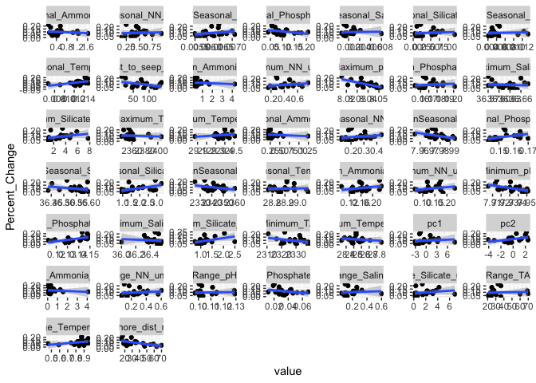

Coral
================
Callie Stephenson
2023-08-29

## Introduction

This is a R Markdown file in which I hope to write out my analyses. I
will use this document to process all the R scripts found in the R
folder and complete my project.

#### Loading the data

``` r
#combine nutrient data and shore distance for a master explanatory variable data sheet
explanatory <- left_join(nut, shore_dist[,c(2:3)], by = join_by(CowTagID))
```

``` r
#now make an all data that has both explanatory and response variables:
all_data <- left_join(data, explanatory, by = join_by(CowTagID))
#suppress warnings because there will be a many-to-many relationship between x and y
all_PAC_data <- all_data %>% 
  filter(Species == "Pocillopora acuta")

all_PRU_data <- all_data %>% 
  filter(Species == "Porites rus")
```

### Data Exploration:

Data exploration focuses on the following points: 1. Outliers 2.
Collinearity 3. Independence (Relationships between response and
explanatory variables)

``` r
par(mfrow = c(4,4), oma=c(1,1,3,1))
hist(PAC_response_data$Change_Over_Area, main="Change Over Area", col="lightblue", xlab="Change_Over_Area")
hist_columns <- c(7:13)
for (i in 1:length(hist_columns)) {
  hist(PAC_response_data[, hist_columns[i]], col="lightblue", 
       main = paste("PAC", colnames(PAC_response_data)[hist_columns[i]], sep=" - "),
       xlab=colnames(data)[hist_columns[i]])
}
hist(PRU_response_data$Change_Over_Area, main="Change Over Area", col="darkolivegreen3", xlab="Change_Over_Area")
for (i in 1:length(hist_columns)) {
  hist(PRU_response_data[, hist_columns[i]], col="darkolivegreen3", 
       main = paste("PRU", colnames(PRU_response_data)[hist_columns[i]], sep=" - "),
       xlab=colnames(data)[hist_columns[i]])
}
main_title <- "Data Exploration"
title(main = main_title, outer = TRUE)
```

<!-- -->

Ok so FSC.Events are both pretty right-skewed. We normally log10
transform these.

#### Look for Outliers:

Buoyant Weight It looks like that 13 A is really off. We know it broke,
so I am removing it and replotted next to it:

Now making a plot to look at outliers:

<!-- --> I
removed PRU V13 A placement because this was broken in the field,
creating a large negative change in buoyant weight.

TLE <!-- -->

### Symbionts

<!-- --> Jess will rerun
PRU 49 (PRU V17 C) with her samples - I likely added twice as much as
needed to the sample, but for now I will omit in my analyses (using
dataframe FCM_no for “no outliers”)

``` r
ggplot(FCM_no, aes(x = Cage_Uncaged, y = log10(FSC.Events_per_cm_2), fill = Species)) +
  geom_violin() +
  geom_jitter(width = 0.2, height = 0, alpha = 0.5) +  # Adding jitter
  scale_fill_fish_d(option = "Acanthurus_olivaceus", alpha = 0.4, begin = 0.3, end = 1)+
  facet_wrap(~Species)+
  labs(title = expression(paste("Symbionts per ", cm^2, " by caging treatment")))+
  theme(plot.title = element_text(hjust = 0.5))
```

<!-- --> same
but other normalization:

``` r
ggplot(FCM_no, aes(x = Cage_Uncaged, y = log10(FSC.Events_per_g_dry_weight), fill = Species)) +
  geom_violin() +
  geom_jitter(width = 0.2, height = 0, alpha = 0.5) +  # Adding jitter
  scale_fill_fish_d(option = "Acanthurus_olivaceus", alpha = 0.4, begin = 0.3, end = 1) +
  facet_wrap(~Species)+
  labs(title = "Symbionts per g dry weight by caging treatment")+
  theme(plot.title = element_text(hjust = 0.5))
```

<!-- -->

### Collinearity

need to make a dataframe that’s long that has all the nutrient metrics
and independent variables Here’s the thing: we KNOW the nutrients are
collinear For example, here’s a pairs plot for the maximum of all the
nutrient values:

``` r
nut_wide <- pivot_wider(
  data = explanatory,
  names_from = Parameters,
  values_from =3:7,
  names_glue = "{.value}_{Parameters}"
)
ggpairs(nut, columns = 2:8,progress = FALSE)
```

<!-- -->
\#### PCA I want to start exploring PCA’s to explain the nutrient
dynamics:

``` r
maximum_columns <- names(nut_wide)[grepl("Maximum_", names(nut_wide)) & 
                                     !grepl("Salinity|Temperature|pH", names(nut_wide))]
minimum_columns <- names(nut_wide)[grepl("Minimum_", names(nut_wide)) & 
                                     grepl("Salinity|Temperature|pH", names(nut_wide))]

pca.max.data <- na.omit(nut_wide[, c(maximum_columns, minimum_columns)]) #keeping V13 in this ex
pca.max = princomp(pca.max.data, cor=TRUE)
summary(pca.max)
```

    ## Importance of components:
    ##                           Comp.1     Comp.2      Comp.3       Comp.4
    ## Standard deviation     2.7174978 0.72987740 0.277101687 0.0573969257
    ## Proportion of Variance 0.9230993 0.06659013 0.009598168 0.0004118009
    ## Cumulative Proportion  0.9230993 0.98968941 0.999287578 0.9996993786
    ##                              Comp.5       Comp.6       Comp.7       Comp.8
    ## Standard deviation     0.0443378286 1.767769e-02 1.032805e-02 4.467520e-03
    ## Proportion of Variance 0.0002457304 3.906257e-05 1.333359e-05 2.494842e-06
    ## Cumulative Proportion  0.9999451090 9.999842e-01 9.999975e-01 1.000000e+00

``` r
loadings(pca.max)
```

    ## 
    ## Loadings:
    ##                         Comp.1 Comp.2 Comp.3 Comp.4 Comp.5 Comp.6 Comp.7 Comp.8
    ## Maximum_TA               0.367         0.115  0.680  0.615                     
    ## Maximum_NN_umolL         0.367         0.132        -0.225  0.826 -0.322       
    ## Maximum_Silicate_umolL   0.367         0.190        -0.254 -0.392 -0.258  0.733
    ## Maximum_Ammonia_umolL    0.262 -0.960                                          
    ## Maximum_Phosphate_umolL  0.367         0.185        -0.412         0.799       
    ## Minimum_Salinity        -0.367        -0.182         0.216  0.395  0.413  0.672
    ## Minimum_pH              -0.366 -0.110 -0.143  0.723 -0.536        -0.141       
    ## Minimum_Temperature     -0.352 -0.189  0.914                                   
    ## 
    ##                Comp.1 Comp.2 Comp.3 Comp.4 Comp.5 Comp.6 Comp.7 Comp.8
    ## SS loadings     1.000  1.000  1.000  1.000  1.000  1.000  1.000  1.000
    ## Proportion Var  0.125  0.125  0.125  0.125  0.125  0.125  0.125  0.125
    ## Cumulative Var  0.125  0.250  0.375  0.500  0.625  0.750  0.875  1.000

These look nice!!!! let’s see what the biplot looks like:

``` r
biplot(pca.max, col = c('grey', 'blue'))
```

<!-- --> So, not
sure why ammonia is so far out there, but this looks kinda nice!

It looks like PC1 is really an axis of SGD influence, and that it can
explain 92% of the variation of these nutrient dynamics. If things are
interacting with PC1, they’re probably doing so due to SGD influence.

PC2 is mostly from Ammmonia, with some influence of pH and temp. I’m not
quite sure how to interpret that yet.

``` r
nut_wide$pc1 = pca.max$scores[,1] #what's this data's score on pc1 axis
nut_wide$pc2 = pca.max$scores[,2] #what's this data's score on pc2 axis

#really, i want it back in explanatory:
explanatory2 <- pivot_longer(
  data = nut_wide,
  cols = -c(CowTagID, lat, lon, shore_dist_m, pc1), # Specifying non-parameter columns
  names_to = c(".value", "Parameter"), 
  names_pattern = "^(.*?)_(.*)$"
)

#wide data
all_data_pca <- left_join(data, explanatory2, by = join_by(CowTagID)) #supress warning bc this has many-to-many relationship
pca_data_wide <- left_join(nut_wide, data, by = join_by(CowTagID))
```

Should I incorporate shore dist? Shore dist might be linear with these
nutrients, if it isn’t, it’s better to put into the models as a separate
variable.

``` r
ggpairs(na.omit(nut_wide), columns = 43:45,progress = FALSE)
```

<!-- --> Not
going to include in PCA, looks like it does its own thing, and can be
built into models separately.

### Independence

### Data Analysis

FCM Data Analysis:

    ##              Df    Sum Sq   Mean Sq F value Pr(>F)
    ## Cage_Uncaged  2 2.802e+08 140086728   0.596  0.555
    ## Residuals    56 1.317e+10 235216369

    ##              Df    Sum Sq  Mean Sq F value Pr(>F)
    ## Cage_Uncaged  2  16430837  8215419   0.659  0.521
    ## Residuals    56 697625032 12457590

### Models

``` r
hist(all_data_pca$pc1)
```

<!-- -->

Now that we’ve done our data exploration, let’s make the data frame
needed to build some models!

``` r
#For models of only caged corals, we are running with Genotype as covariate instead of random effect
#Cannot run as random effect without singularity (as there is only one occurance of genotype for every occurence of the nutrient parameter)
#for example, see how this is singular:

bw_m1_caged_PAC <-lmer(Percent_Change ~ shore_dist_m + (1 | Genotype), data = all_data %>% 
                    filter(Parameters == "Salinity" & Species == "Pocillopora acuta" & Cage_Uncaged == "C")) 
```

    ## boundary (singular) fit: see help('isSingular')

``` r
anova(bw_m1_caged_PAC)
```

    ## Type III Analysis of Variance Table with Satterthwaite's method
    ##               Sum Sq Mean Sq NumDF DenDF F value  Pr(>F)  
    ## shore_dist_m 0.01686 0.01686     1    17  8.0184 0.01151 *
    ## ---
    ## Signif. codes:  0 '***' 0.001 '**' 0.01 '*' 0.05 '.' 0.1 ' ' 1

``` r
summary(bw_m1_caged_PAC)
```

    ## Linear mixed model fit by REML. t-tests use Satterthwaite's method [
    ## lmerModLmerTest]
    ## Formula: Percent_Change ~ shore_dist_m + (1 | Genotype)
    ##    Data: 
    ## all_data %>% filter(Parameters == "Salinity" & Species == "Pocillopora acuta" &  
    ##     Cage_Uncaged == "C")
    ## 
    ## REML criterion at convergence: -45.1
    ## 
    ## Scaled residuals: 
    ##      Min       1Q   Median       3Q      Max 
    ## -1.66525 -0.80143  0.04358  0.38182  2.08920 
    ## 
    ## Random effects:
    ##  Groups   Name        Variance Std.Dev.
    ##  Genotype (Intercept) 0.000000 0.00000 
    ##  Residual             0.002103 0.04585 
    ## Number of obs: 19, groups:  Genotype, 6
    ## 
    ## Fixed effects:
    ##                Estimate Std. Error         df t value Pr(>|t|)    
    ## (Intercept)   0.1623068  0.0246026 17.0000000   6.597 4.53e-06 ***
    ## shore_dist_m -0.0018048  0.0006373 17.0000000  -2.832   0.0115 *  
    ## ---
    ## Signif. codes:  0 '***' 0.001 '**' 0.01 '*' 0.05 '.' 0.1 ' ' 1
    ## 
    ## Correlation of Fixed Effects:
    ##             (Intr)
    ## shore_dst_m -0.904
    ## optimizer (nloptwrap) convergence code: 0 (OK)
    ## boundary (singular) fit: see help('isSingular')

``` r
##plots with megan
ggplot(all_PAC_data) +
  geom_point(data = subset(all_PAC_data, Cage_Uncaged == "C"),
             aes(x = Genotype, y = Percent_Change, color = shore_dist_m)) +
  scale_color_fish(option = "Coryphaena_hippurus")
```

<!-- -->

``` r
#this shore distance looks like it could be a trend

#variance components analysis within genotype and between genotype variance
#looking at all the variance in the data, looking at the grand mean vs. the mean for the random effects
#how much is between vs within genotype variance
bw_m1_caged_PRU <-lmer(Percent_Change ~ shore_dist_m + (1 | Genotype), data = all_data %>% 
                    filter(Parameters == "Salinity" & Species == "Porites rus" & Cage_Uncaged == "C")) 
anova(bw_m1_caged_PRU)
```

    ## Type III Analysis of Variance Table with Satterthwaite's method
    ##                  Sum Sq    Mean Sq NumDF  DenDF F value Pr(>F)
    ## shore_dist_m 0.00071589 0.00071589     1 14.874  0.2342 0.6355

``` r
summary(bw_m1_caged_PRU)
```

    ## Linear mixed model fit by REML. t-tests use Satterthwaite's method [
    ## lmerModLmerTest]
    ## Formula: Percent_Change ~ shore_dist_m + (1 | Genotype)
    ##    Data: 
    ## all_data %>% filter(Parameters == "Salinity" & Species == "Porites rus" &  
    ##     Cage_Uncaged == "C")
    ## 
    ## REML criterion at convergence: -40.2
    ## 
    ## Scaled residuals: 
    ##     Min      1Q  Median      3Q     Max 
    ## -1.5101 -0.5620 -0.3488  0.5597  1.8883 
    ## 
    ## Random effects:
    ##  Groups   Name        Variance  Std.Dev.
    ##  Genotype (Intercept) 0.0002999 0.01732 
    ##  Residual             0.0030570 0.05529 
    ## Number of obs: 20, groups:  Genotype, 6
    ## 
    ## Fixed effects:
    ##                Estimate Std. Error         df t value Pr(>|t|)   
    ## (Intercept)   0.1160243  0.0316518 12.5192659   3.666  0.00302 **
    ## shore_dist_m -0.0003798  0.0007847 14.8741471  -0.484  0.63549   
    ## ---
    ## Signif. codes:  0 '***' 0.001 '**' 0.01 '*' 0.05 '.' 0.1 ' ' 1
    ## 
    ## Correlation of Fixed Effects:
    ##             (Intr)
    ## shore_dst_m -0.892

``` r
ggplot(all_PRU_data) +
  geom_point(data = subset(all_PRU_data, Cage_Uncaged == "C"),
             aes(x = Genotype, y = Percent_Change, color = shore_dist_m))+
  scale_color_fish(option = "Coryphaena_hippurus")
```

<!-- -->

Same models as before, but now with silicate instead, because the range
in SiO32- was an order of magnitude higher on the reef than salinity
allowing for a higher signal to noise ratio. I also used maximum
silicate, as it is more indicative of the maximum amount of groundwater
experienced

This also only sees a correlation between all (not just caged) change in
buoyant weight for PRU. PAC is not significant.

Now let’s see those same models with symbiont counts

Nothing significant there

IGNORE THESE PLOTS:
