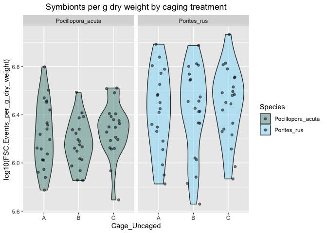
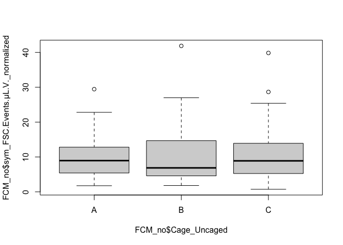

Coral
================
Callie Stephenson
2023-08-29

### Introduction

This is a R Markdown file in which I hope to write out my analyses. I
will use this document to process all the R scripts found in the R
folder and complete my project.

#### Loading the data

    ## ── Attaching core tidyverse packages ──────────────────────── tidyverse 2.0.0 ──
    ## ✔ dplyr     1.1.3     ✔ readr     2.1.4
    ## ✔ forcats   1.0.0     ✔ stringr   1.5.0
    ## ✔ ggplot2   3.4.4     ✔ tibble    3.2.1
    ## ✔ lubridate 1.9.3     ✔ tidyr     1.3.0
    ## ✔ purrr     1.0.2     
    ## ── Conflicts ────────────────────────────────────────── tidyverse_conflicts() ──
    ## ✖ dplyr::filter() masks stats::filter()
    ## ✖ dplyr::lag()    masks stats::lag()
    ## ℹ Use the conflicted package (<http://conflicted.r-lib.org/>) to force all conflicts to become errors
    ## here() starts at /Users/calliestephenson/Documents/GitHub/MooreaCoralFish_CS
    ## 
    ## 
    ## Attaching package: 'kableExtra'
    ## 
    ## 
    ## The following object is masked from 'package:dplyr':
    ## 
    ##     group_rows
    ## 
    ## 
    ## Loading required package: Matrix
    ## 
    ## 
    ## Attaching package: 'Matrix'
    ## 
    ## 
    ## The following objects are masked from 'package:tidyr':
    ## 
    ##     expand, pack, unpack
    ## 
    ## 
    ## 
    ## Attaching package: 'lme4'
    ## 
    ## 
    ## The following object is masked from 'package:AICcmodavg':
    ## 
    ##     checkConv
    ## 
    ## 
    ## 
    ## Attaching package: 'ggpp'
    ## 
    ## 
    ## The following object is masked from 'package:ggplot2':
    ## 
    ##     annotate

# Buoyant Weight:

## Look for Outliers

FCM Data Analysis:

``` r
nut <- read.csv("data/March_nutrients_processed.csv")
FCM <- read.csv("output/FCM_data.csv")
ggplot(FCM)+
  geom_point(aes(x=Cage_Uncaged, y=sym_FSC.Events, color=Species))
```

<!-- -->

``` r
ggplot(FCM)+
  geom_boxplot(aes(x=Cage_Uncaged, y=sym_FSC.Events, color = Species))
```

<!-- -->

``` r
FCM$CowTagID <- paste0("V",FCM$Pin_Number) #make a joining variable
all_data <- left_join(FCM, nut, by="CowTagID")  #join them
all_data <- drop_na(all_data)

m1 <- lm(sym_FSC.Events ~ log(Maximum), data= all_data %>%
           filter(Parameters=="Silicate_umolL"))
anova(m1)
```

    ## Analysis of Variance Table
    ## 
    ## Response: sym_FSC.Events
    ##               Df   Sum Sq Mean Sq F value Pr(>F)
    ## log(Maximum)   1    11277   11277   0.108  0.743
    ## Residuals    117 12219556  104441

``` r
summary(m1)
```

    ## 
    ## Call:
    ## lm(formula = sym_FSC.Events ~ log(Maximum), data = all_data %>% 
    ##     filter(Parameters == "Silicate_umolL"))
    ## 
    ## Residuals:
    ##     Min      1Q  Median      3Q     Max 
    ## -406.19 -226.12  -75.15  117.91 1718.76 
    ## 
    ## Coefficients:
    ##              Estimate Std. Error t value Pr(>|t|)    
    ## (Intercept)    388.77      54.79   7.096 1.06e-10 ***
    ## log(Maximum)    16.43      49.99   0.329    0.743    
    ## ---
    ## Signif. codes:  0 '***' 0.001 '**' 0.01 '*' 0.05 '.' 0.1 ' ' 1
    ## 
    ## Residual standard error: 323.2 on 117 degrees of freedom
    ## Multiple R-squared:  0.000922,   Adjusted R-squared:  -0.007617 
    ## F-statistic: 0.108 on 1 and 117 DF,  p-value: 0.743

``` r
max <- all_data %>% 
       filter(Parameters=="Silicate_umolL")

hist(max$Maximum)
```

<!-- -->
